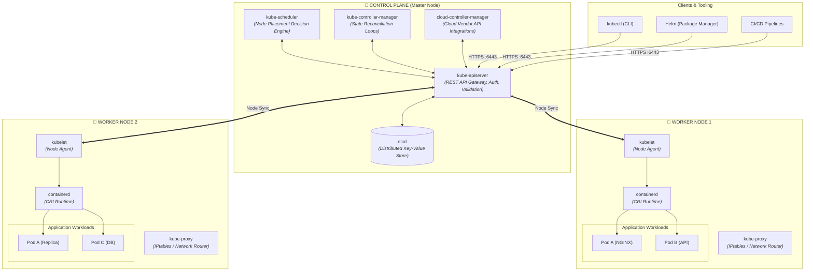
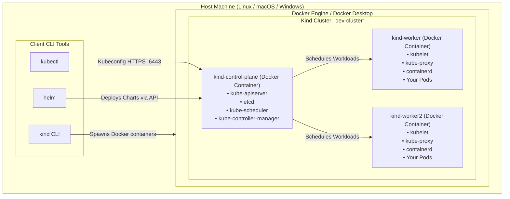

# ☸️ Kubernetes & KinD Master Lab: Complete Setup & Architecture Guide

[](https://kubernetes.io/)
[](https://kind.sigs.k8s.io/)
[](https://www.docker.com/)
[](https://helm.sh/)
[](#)

> **A beginner-to-advanced hands-on tutorial: Learn what Kubernetes is, master its distributed architecture and components, and spin up a multi-node local cluster with KinD, Docker, `kubectl`, and `helm` across Linux, macOS, and Windows.**

---

## 📑 Table of Contents

1. [💡 What is Kubernetes (K8s)?](#1--what-is-kubernetes-k8s)
   - [Why do we need Kubernetes?](#why-do-we-need-kubernetes)
   - [Key Superpowers of Kubernetes](#key-superpowers-of-kubernetes)
2. [🏛️ Kubernetes Architecture & Core Components](#2-️-kubernetes-architecture--core-components)
   - [Architectural Overview Diagram](#architectural-overview-diagram)
   - [Control Plane Components (The Brain)](#1-control-plane-components-the-brain)
   - [Worker Node Components (The Muscle)](#2-worker-node-components-the-muscle)
   - [Core Kubernetes Objects (The Building Blocks)](#3-core-kubernetes-objects-the-building-blocks)
3. [📦 How KinD (Kubernetes in Docker) Fits In](#3--how-kind-kubernetes-in-docker-fits-in)
4. [💻 System Prerequisites](#4--system-prerequisites)
5. [Step 1: Install Docker](#step-1-install-docker)
6. [Step 2: Install kubectl (CLI)](#step-2-install-kubectl-cli)
   - [🐧 Linux](#-linux-kubectl)
   - [🍎 macOS](#-macos-kubectl)
   - [🪟 Windows](#-windows-kubectl)
   - [Verification & Autocompletion](#-verify-kubectl)
7. [Step 3: Install Kind (Kubernetes in Docker)](#step-3-install-kind-kubernetes-in-docker)
   - [🐧 Linux](#-linux-kind)
   - [🍎 macOS](#-macos-kind)
   - [🪟 Windows](#-windows-kind)
   - [Verification](#-verify-kind)
8. [Step 4: Install Helm (Package Manager)](#step-4-install-helm-package-manager)
   - [🐧 Linux](#-linux-helm)
   - [🍎 macOS](#-macos-helm)
   - [🪟 Windows](#-windows-helm)
   - [Verification](#-verify-helm)
9. [Step 5: Spin Up Your Kind Cluster](#step-5-spin-up-your-kind-cluster)
   - [Option A: Simple Single-Node Cluster](#option-a-simple-single-node-cluster)
   - [Option B: Multi-Node Cluster with Ingress Support (Recommended)](#option-b-multi-node-cluster-with-ingress-support-recommended)
10. [Step 6: Verifying Your Cluster](#step-6-verifying-your-cluster)
11. [Step 7: Deploy a Test App with Helm](#step-7-deploy-a-test-app-with-helm)
12. [Useful Commands & Cluster Management](#useful-commands--cluster-management)
13. [Troubleshooting & Pro Tips](#troubleshooting--pro-tips)

---

## 1. 💡 What is Kubernetes (K8s)?

**Kubernetes** (often called **K8s** because there are 8 letters between 'K' and 's') is an open-source **container orchestration platform**. It was originally designed and built by Google based on over 15 years of experience running production workloads at scale with internal systems (**Borg** and **Omega**). In 2014, Google open-sourced Kubernetes and donated it to the **CNCF (Cloud Native Computing Foundation)**.

### Why do we need Kubernetes?

```
┌─────────────────────────────────┐       ┌──────────────────────────────────────┐
│       Docker (Containers)       │  VS   │        Kubernetes (Orchestrator)     │
├─────────────────────────────────┤       ├──────────────────────────────────────┤
│ • Runs a single container       │       │ • Manages thousands of containers    │
│ • Runs on a single host machine │       │ • Spans across a cluster of machines │
│ • Manual restart if it crashes  │       │ • Automatic self-healing & recovery  │
│ • Manual scaling & networking   │       │ • Automated scaling & load balancing │
└─────────────────────────────────┘       └──────────────────────────────────────┘
```

> [!NOTE]
> **The Cattle vs. Pets Analogy:**  
> Before Kubernetes, servers were treated like **pets** (given names like `db-server-01`, carefully nurtured, and mourned when they crashed). Kubernetes treats infrastructure like **cattle** (numbered, interchangeable instances). If one crashes, Kubernetes replaces it automatically in seconds without human intervention.

### Key Superpowers of Kubernetes

| Superpower | What It Does |
| :--- | :--- |
| 🔄 **Self-Healing** | Automatically restarts containers that fail, replaces pods when nodes die, and kills unready containers that don't pass health checks. |
| 📈 **Horizontal Auto-scaling** | Scales applications up or down dynamically based on CPU/Memory usage or custom metrics (e.g., HTTP request queue depth). |
| ⚖️ **Load Balancing & Discovery** | Assigns stable IP addresses and a single DNS name for sets of containers, automatically distributing incoming network traffic. |
| 🚀 **Zero-Downtime Rollouts** | Gradually replaces old version pods with new versions (Rolling Updates) and can instantly roll back if any errors occur. |
| 🔐 **Config & Secret Management** | Stores sensitive credentials, API keys, and configs separately from application container images. |
| 💾 **Storage Orchestration** | Automatically mounts local storage, cloud storage (AWS EBS, GCP PD, Azure Disk), or network shares (NFS, Ceph). |

---

## 2. 🏛️ Kubernetes Architecture & Core Components

A Kubernetes cluster is a distributed system consisting of two primary operational planes:
1. **Control Plane (The Brain)**: Makes global decisions about the cluster (scheduling, scaling, detecting failures, maintaining the desired state).
2. **Worker Nodes (The Muscle)**: The physical or virtual machines that actually run your containerized applications (Pods).

### Architectural Overview Diagram



---

### 1. Control Plane Components (The Brain)

#### 🚪 `kube-apiserver`
- **Role:** Front-door and central nervous system of Kubernetes.
- **How it works:** Exposes the Kubernetes HTTP/REST API. Every administrative tool (`kubectl`, `helm`, web dashboards) and every worker node communicates exclusively with `kube-apiserver`.
- **Key traits:** It is stateless and the **only component** allowed to directly query or write to `etcd`.

#### 🗄️ `etcd`
- **Role:** The cluster's database and single source of truth.
- **How it works:** A lightweight, strongly consistent, distributed key-value store (using the Raft consensus algorithm).
- **Key traits:** Stores the complete specification and live state of every object in the cluster (Pods, Secrets, Nodes, Services). If it's not in `etcd`, it doesn't exist in Kubernetes!

#### 🧭 `kube-scheduler`
- **Role:** The matchmaker for Pods and Nodes.
- **How it works:** Watches for newly created Pods that have no assigned node. It evaluates node capacity, CPU/memory constraints, affinity/anti-affinity rules, and taints/tolerations to pick the best node to host each Pod.
- **Key traits:** The scheduler only **decides** where a pod should go; it doesn't actually launch the pod (that is the `kubelet`'s job).

#### ⚙️ `kube-controller-manager`
- **Role:** The regulator that enforces the "Desired State".
- **How it works:** Runs non-stop background control loops comparing the *current state* with the *desired state*:
  - **Node Controller:** Notices when a node goes offline and evicts its pods.
  - **ReplicaSet Controller:** Ensures the specified number of pod replicas are running at all times.
  - **Endpoints Controller:** Populates EndpointSlice objects (joining Services to Pods).
  - **ServiceAccount Controller:** Creates default accounts and API access tokens for new namespaces.

#### ☁️ `cloud-controller-manager`
- **Role:** Bridge between Kubernetes and public cloud providers (AWS, GCP, Azure).
- **How it works:** Manages cloud-specific resources such as provisioning cloud Load Balancers, configuring cloud storage volumes, and checking if cloud instances are stopped.

---

### 2. Worker Node Components (The Muscle)

#### 👷 `kubelet`
- **Role:** The captain of the node.
- **How it works:** An agent that runs on every worker node in the cluster. It takes a set of `PodSpecs` provided by the `kube-apiserver` and ensures that the containers described in those specs are running and healthy.
- **Key traits:** If a container crashes, `kubelet` restarts it. It also reports node resource status (CPU, memory) back to the control plane.

#### 🌐 `kube-proxy`
- **Role:** The network traffic cop on each node.
- **How it works:** Maintains network packet-filtering rules (using Linux `iptables` or `IPVS`) on each node.
- **Key traits:** Translates Service virtual IPs (`ClusterIP`) into the real IP addresses of healthy backend pods and balances traffic among them.

#### 📦 `Container Runtime (CRI)`
- **Role:** The software engine that runs containers.
- **How it works:** Downloads container images, extracts root filesystems, creates isolated namespaces/cgroups, and executes container processes.
- **Examples:** `containerd` (default in modern K8s & Kind), `CRI-O`.

---

### 3. Core Kubernetes Objects (The Building Blocks)

| Object | Icon | Description | Real-World Metaphor |
| :--- | :---: | :--- | :--- |
| **Pod** | 📦 | The smallest atomic deployable unit in K8s. Houses one or more containers sharing localhost & volume storage. | A single shipping container or hotel room |
| **Deployment** | 🔄 | Declarative controller for stateless applications. Manages replica counts, zero-downtime rolling updates, and instant rollbacks. | Fleet manager keeping 5 identical delivery vans on the road |
| **Service** | 🌐 | A stable network endpoint (IP + DNS name) that provides load balancing over a dynamic group of ephemeral Pods. | A company's main phone switchboard routing calls to active operators |
| **Ingress** | 🚪 | An API object that manages external HTTP/S access to services within the cluster (path-based routing, SSL termination). | The front reception desk directing visitors to the right department |
| **ConfigMap & Secret** | 🔐 | Stores plain configurations or sensitive data (passwords, tokens) to inject into containers as environment variables or mounted files. | Lockbox & configuration manual handed to employees upon hire |
| **Namespace** | 🏷️ | A virtual slice of the cluster providing scoping for names and isolation for teams, environments (`dev`, `prod`), or tenants. | Different office floors or departments in a single corporate building |
| **PersistentVolume (PV / PVC)**| 💾 | Decoupled durable storage that persists even if Pods or nodes crash and restart. | An external hard drive plugged into any available workstation |

---

## 3. 📦 How KinD (Kubernetes in Docker) Fits In

Running a real multi-node Kubernetes cluster normally requires multiple Virtual Machines or expensive cloud accounts (EKS, GKE, AKS).

**KinD (Kubernetes IN Docker)** solves this elegantly:
- **Each Kubernetes Node is a Docker container.**
- A 3-node cluster simply runs **3 Docker containers** on your host machine!
- Inside each Docker container runs `systemd`, `containerd`, `kubelet`, and `kubeadm`.



---

## 4. 💻 System Prerequisites

| Component | Minimum Requirement | Recommended |
| :--- | :--- | :--- |
| **CPU** | 2 cores | 4+ cores |
| **RAM** | 4 GB | 8 GB or 16 GB |
| **Disk** | 10 GB free space | 20+ GB free space |
| **Virtualization** | Enabled in BIOS/UEFI | Enabled (VT-x / AMD-V) |

---

## Step 1: Install Docker

Kind requires a functional Docker daemon running on your host system.

### 🐧 Linux (Ubuntu / Debian)
```bash
# Remove older conflicting versions
sudo apt-get remove docker docker-engine docker.io containerd runc -y

# Install Docker using the official convenience script
curl -fsSL https://get.docker.com -o get-docker.sh
sudo sh get-docker.sh

# Run Docker as a non-root user (so you don't need 'sudo' every time)
sudo usermod -aG docker $USER
newgrp docker

# Verify Docker is running
docker run hello-world
```

### 🍎 macOS
1. Download **[Docker Desktop for Mac](https://www.docker.com/products/docker-desktop/)** (Choose Apple Silicon or Intel chip).
2. Open the `.dmg` file and drag Docker into **Applications**.
3. Launch Docker Desktop and accept the terms.
*(Alternative lightweight open-source option: `brew install colima docker && colima start`)*

### 🪟 Windows
1. Ensure **WSL 2** is installed:
   ```powershell
   wsl --install
   ```
2. Download and install **[Docker Desktop for Windows](https://www.docker.com/products/docker-desktop/)**.
3. During setup, check **"Use WSL 2 instead of Hyper-V"**.
4. Open Docker Desktop **Settings > Resources > WSL Integration** and enable your Linux distro.

---

## Step 2: Install kubectl (CLI)

`kubectl` is the official Kubernetes command-line tool used to interact with the cluster control plane.

### 🐧 Linux (kubectl)

#### Method 1: Using `curl` (Recommended)
```bash
# 1. Download the latest stable release
curl -LO "https://dl.k8s.io/release/$(curl -L -s https://dl.k8s.io/release/stable.txt)/bin/linux/amd64/kubectl"

# 2. Validate binary (optional)
curl -LO "https://dl.k8s.io/release/$(curl -L -s https://dl.k8s.io/release/stable.txt)/bin/linux/amd64/kubectl.sha256"
echo "$(cat kubectl.sha256)  kubectl" | sha256sum --check

# 3. Install kubectl
sudo install -o root -g root -m 0755 kubectl /usr/local/bin/kubectl

# 4. Clean up temporary files
rm kubectl kubectl.sha256
```

#### Method 2: Package Managers
- **Ubuntu/Debian (APT):**
  ```bash
  sudo apt-get update && sudo apt-get install -y apt-transport-https ca-certificates curl gnupg
  curl -fsSL https://pkgs.k8s.io/core:/stable:/v1.32/deb/Release.key | sudo gpg --dearmor -o /etc/apt/keyrings/kubernetes-apt-keyring.gpg
  sudo chmod 644 /etc/apt/keyrings/kubernetes-apt-keyring.gpg
  echo 'deb [signed-by=/etc/apt/keyrings/kubernetes-apt-keyring.gpg] https://pkgs.k8s.io/core:/stable:/v1.32/deb/ /' | sudo tee /etc/apt/sources.list.d/kubernetes.list
  sudo apt-get update && sudo apt-get install -y kubectl
  ```
- **Snap:**
  ```bash
  sudo snap install kubectl --classic
  ```

---

### 🍎 macOS (kubectl)

#### Method 1: Using Homebrew (Recommended)
```bash
brew install kubectl
```

#### Method 2: Using `curl`
```bash
# For Apple Silicon (M1/M2/M3/M4):
curl -LO "https://dl.k8s.io/release/$(curl -L -s https://dl.k8s.io/release/stable.txt)/bin/darwin/arm64/kubectl"

# For Intel Mac:
curl -LO "https://dl.k8s.io/release/$(curl -L -s https://dl.k8s.io/release/stable.txt)/bin/darwin/amd64/kubectl"

# Make it executable and move to PATH
chmod +x ./kubectl
sudo mv ./kubectl /usr/local/bin/kubectl
sudo chown root: /usr/local/bin/kubectl
```

---

### 🪟 Windows (kubectl)

#### Method 1: Using Winget (Recommended)
```powershell
winget install -e --id Kubernetes.kubectl
```

#### Method 2: Using Chocolatey or Scoop
```powershell
# Chocolatey
choco install kubernetes-cli

# Scoop
scoop install kubectl
```

#### Method 3: Using PowerShell (Direct Download)
```powershell
# Create folder and download
New-Item -ItemType Directory -Force -Path C:\k8s
curl.exe -LO "https://dl.k8s.io/release/v1.32.0/bin/windows/amd64/kubectl.exe" -OutFile C:\k8s\kubectl.exe

# Add to your User PATH
[Environment]::SetEnvironmentVariable("Path", $env:Path + ";C:\k8s", [EnvironmentVariableTarget]::User)
```

---

### 🔍 Verify kubectl
```bash
kubectl version --client --output=yaml
```
> [!TIP]
> **Enable Shell Autocompletion & Alias:**
> ```bash
> # Add to ~/.bashrc or ~/.zshrc
> alias k=kubectl
> complete -o default -F __start_kubectl k
> source <(kubectl completion bash) # or 'zsh'
> ```

---

## Step 3: Install Kind (Kubernetes in Docker)

### 🐧 Linux (kind)

```bash
# Detect architecture and download
[ $(uname -m) = x86_64 ] && curl -Lo ./kind https://kind.sigs.k8s.io/dl/v0.27.0/kind-linux-amd64
[ $(uname -m) = aarch64 ] && curl -Lo ./kind https://kind.sigs.k8s.io/dl/v0.27.0/kind-linux-arm64

# Grant execute permissions
chmod +x ./kind

# Move to system PATH
sudo mv ./kind /usr/local/bin/kind
```

---

### 🍎 macOS (kind)

#### Method 1: Using Homebrew (Recommended)
```bash
brew install kind
```

#### Method 2: Using `curl`
```bash
# For Apple Silicon (M1/M2/M3/M4):
curl -Lo ./kind https://kind.sigs.k8s.io/dl/v0.27.0/kind-darwin-arm64

# For Intel Mac:
curl -Lo ./kind https://kind.sigs.k8s.io/dl/v0.27.0/kind-darwin-amd64

chmod +x ./kind
sudo mv ./kind /usr/local/bin/kind
```

---

### 🪟 Windows (kind)

#### Method 1: Using Winget (Recommended)
```powershell
winget install Kubernetes.kind
```

#### Method 2: Using Chocolatey or Scoop
```powershell
# Chocolatey
choco install kind

# Scoop
scoop install kind
```

#### Method 3: Using PowerShell (Direct Download)
```powershell
curl.exe -Lo C:\k8s\kind.exe https://kind.sigs.k8s.io/dl/v0.27.0/kind-windows-amd64
```

---

### 🔍 Verify kind
```bash
kind version
```

---

## Step 4: Install Helm (Package Manager)

Helm is the de-facto package manager for Kubernetes (like `apt` for Ubuntu or `npm` for Node.js).

### 🐧 Linux (helm)

#### Method 1: Automated Script (Recommended)
```bash
curl -fsSL -o get_helm.sh https://raw.githubusercontent.com/helm/helm/main/scripts/get-helm-3
chmod 700 get_helm.sh
./get_helm.sh
rm get_helm.sh
```

#### Method 2: Package Managers
- **Debian / Ubuntu:**
  ```bash
  curl https://baltocdn.com/helm/signing.asc | gpg --dearmor | sudo tee /usr/share/keyrings/helm.gpg > /dev/null
  sudo apt-get install apt-transport-https --yes
  echo "deb [arch=$(dpkg --print-architecture) signed-by=/usr/share/keyrings/helm.gpg] https://baltocdn.com/helm/stable/debian/ all main" | sudo tee /etc/apt/sources.list.d/helm-stable-debian.list
  sudo apt-get update && sudo apt-get install helm -y
  ```
- **Snap:**
  ```bash
  sudo snap install helm --classic
  ```

---

### 🍎 macOS (helm)

```bash
brew install helm
```

---

### 🪟 Windows (helm)

#### Method 1: Using Winget (Recommended)
```powershell
winget install Helm.Helm
```

#### Method 2: Using Chocolatey or Scoop
```powershell
# Chocolatey
choco install kubernetes-helm

# Scoop
scoop install helm
```

---

### 🔍 Verify helm
```bash
helm version
```

---

## Step 5: Spin Up Your Kind Cluster

Now that Docker, kubectl, kind, and helm are installed, let's create a Kubernetes cluster!

### Option A: Simple Single-Node Cluster
The simplest way to create a cluster:

```bash
kind create cluster --name my-cluster
```

To delete this simple cluster when finished:
```bash
kind delete cluster --name my-cluster
```

---

### Option B: Multi-Node Cluster with Ingress Support (Recommended)

In real-world environments, clusters have dedicated **control-plane** and **worker** nodes, and require port mapping for HTTP/HTTPS ingress traffic (port 80 & 443).

Create a configuration file named `kind-config.yaml`:

```yaml
# kind-config.yaml
kind: Cluster
apiVersion: kind.x-k8s.io/v1alpha4
name: dev-cluster
nodes:
  # Control-Plane Node with Port Mappings for Ingress
  - role: control-plane
    kubeadmConfigPatches:
      - |
        kind: InitConfiguration
        nodeRegistration:
          kubeletExtraArgs:
            node-labels: "ingress-ready=true"
    extraPortMappings:
      - containerPort: 80
        hostPort: 80
        protocol: TCP
      - containerPort: 443
        hostPort: 443
        protocol: TCP
  # Worker Node 1
  - role: worker
  # Worker Node 2
  - role: worker
```

#### 🚀 Create the cluster using the configuration:
```bash
kind create cluster --config "Big Data Project/infra setup/kind-config.yaml"
```

**Expected output:**
```text
Creating cluster "dev-cluster" ..
 • Ensuring node image (kindest/node:v1.32.0) 🖼
 • Preparing nodes 📦 📦 📦  
 • Writing configuration 📜 
 • Starting control-plane 🕹️ 
 • Installing CNI 🔌 
 • Installing StorageClass 💾 
 • Joining worker nodes 🚜 
Set kubectl context to "kind-dev-cluster"
You can now use your cluster with:

kubectl cluster-info --context kind-dev-cluster
```

---

## Step 6: Verifying Your Cluster

### 1. Inspect running Docker containers:
Kind creates a container for each node in your cluster.

```bash
docker ps --format "table {{.ID}}	{{.Names}}	{{.Status}}	{{.Ports}}"
```

You will see:
- `dev-cluster-control-plane`
- `dev-cluster-worker`
- `dev-cluster-worker2`

### 2. Check cluster nodes with kubectl:
```bash
kubectl get nodes -o wide
```

Output:
```text
NAME                        STATUS   ROLES           AGE   VERSION   INTERNAL-IP   OS-IMAGE
dev-cluster-control-plane   Ready    control-plane   2m    v1.32.0   172.18.0.4    Ubuntu 24.04 LTS
dev-cluster-worker          Ready    <none>          2m    v1.32.0   172.18.0.3    Ubuntu 24.04 LTS
dev-cluster-worker2         Ready    <none>          2m    v1.32.0   172.18.0.2    Ubuntu 24.04 LTS
```

### 3. Check cluster info & core pods:
```bash
kubectl cluster-info
kubectl get pods -A
```

---

## Step 7: Deploy a Test App with Helm

Let's test Helm and your new Kind cluster by deploying an NGINX server!

### 1. Add the Bitnami Helm Repository:
```bash
helm repo add bitnami https://charts.bitnami.com/bitnami
helm repo update
```

### 2. Install NGINX using Helm:
```bash
helm install my-web bitnami/nginx --set service.type=ClusterIP
```

### 3. Verify the deployment:
```bash
kubectl get pods -l app.kubernetes.io/name=nginx
helm list
```

### 4. Access the application using port-forward:
```bash
kubectl port-forward svc/my-web-nginx 8080:80
```
Open your browser and navigate to: **`http://localhost:8080`** 🎉

*(Press `Ctrl + C` to stop port forwarding)*

### 5. Clean up the Helm release:
```bash
helm uninstall my-web
```

---

## Useful Commands & Cluster Management

| Task | Command |
| :--- | :--- |
| **List all Kind clusters** | `kind get clusters` |
| **List nodes belonging to a cluster** | `kind get nodes --name dev-cluster` |
| **View current kubeconfig context** | `kubectl config current-context` |
| **Switch kubeconfig context** | `kubectl config use-context kind-dev-cluster` |
| **Load local Docker image into Kind** | `kind load docker-image my-custom-app:latest --name dev-cluster` |
| **Export cluster logs for debugging** | `kind export logs ./kind-logs --name dev-cluster` |
| **Delete the cluster** | `kind delete cluster --name dev-cluster` |

---

## Troubleshooting & Pro Tips

> [!WARNING]
> **Docker Daemon is not running:**  
> If you get `ERROR: failed to create cluster: node(s) already exist or docker daemon is not responding`, ensure Docker Desktop or your Docker service is active:
> ```bash
> sudo systemctl status docker  # Linux
> ```

> [!IMPORTANT]
> **Port Conflicts on Ports 80 / 443:**  
> If you bind `hostPort: 80` or `443` in `kind-config.yaml` and another service (like Apache, local NGINX, or Skype/IIS) is using that port, Kind will fail to start. Either stop the conflicting service or change the `hostPort` (e.g., `8081:80`).

> [!TIP]
> **Loading Local Images Without a Registry:**  
> When building custom images locally, you do **not** need to push them to Docker Hub. Build it with Docker, then load it directly into Kind:
> ```bash
> docker build -t my-app:v1 .
> kind load docker-image my-app:v1 --name dev-cluster
> ```
> In your Kubernetes Deployment manifest, remember to set:
> ```yaml
> imagePullPolicy: Never # or IfNotPresent
> ```

---

## 🎯 Summary Checklist

- [x] Understand Kubernetes concept & architecture (Control Plane & Worker Nodes)
- [x] Docker installed & running
- [x] `kubectl` installed & verified
- [x] `kind` installed & verified
- [x] `helm` installed & verified
- [x] Multi-node Kind cluster running
- [x] Deployed first application with Helm

---

## 🚀 Next Hands-On Tutorials

Now that your local Kubernetes cluster is operational, proceed to deploy production workloads:

- 🐘 **[Deploying PostgreSQL & Connecting via DBeaver](postgresql/postgresql_install.md)**: Deploy a persistent PostgreSQL 16 database using Helm or native K8s manifests and connect from your local desktop using DBeaver GUI.
- ⚡ **[Deploying Apache Spark on Kubernetes](spark/spark_install.md)**: Deploy an Apache Spark 3.5+ cluster, access the Web UI, and execute distributed batch & PySpark jobs using Helm and native manifests.
- 🐙 **[Deploying ArgoCD for GitOps Continuous Delivery](argocd/argocd_install.md)**: Deploy the CNCF-graduated ArgoCD engine, access the Web UI, and automate GitOps deployments with self-healing & drift detection.
- 🚦 **[Modern L4 + L7 Ingress: Traefik v3](traefik/traefik_install.md)**: Replace clunky NodePorts and eliminate `kubectl port-forward`! Route web dashboards (`spark.local`, `argocd.local`) AND route PostgreSQL TCP (`localhost:5432` to DBeaver) directly via Traefik.
- 📦 **[Deploying Apache Ozone (Next-Gen HDFS)](apache-ozone/ozone_install.md)**: Deploy a scalable distributed object store (OM, SCM, Datanodes, S3 Gateway, Recon Web UI) for big data analytics with Spark.
