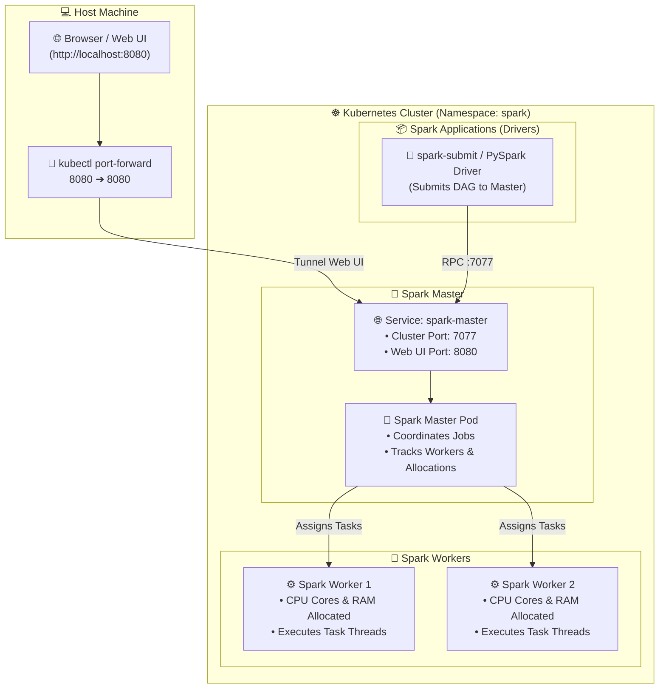

# ⚡ Deploying Apache Spark on Kubernetes & Running Distributed Jobs

[](https://spark.apache.org/)
[](https://kubernetes.io/)
[](https://helm.sh/)
[](https://spark.apache.org/docs/latest/api/python/)
[](https://kind.sigs.k8s.io/)

> **A complete hands-on guide to deploying an Apache Spark cluster on Kubernetes (KinD), accessing the Spark Web UI, and executing distributed batch & PySpark jobs using Helm and native Kubernetes manifests.**

---

## 📑 Table of Contents

1. [Architecture & How Spark Runs on Kubernetes](#1-architecture--how-spark-runs-on-kubernetes)
2. [Prerequisites](#2-prerequisites)
3. [Method 1: Deploy with Helm (Bitnami - Recommended)](#method-1-deploy-with-helm-bitnami---recommended)
   - [Step 1: Add Bitnami Helm Repository](#step-1-add-bitnami-helm-repository)
   - [Step 2: Create Custom spark-values.yaml](#step-2-create-custom-spark-valuesyaml)
   - [Step 3: Deploy Spark Cluster](#step-3-deploy-spark-cluster)
4. [Method 2: Deploy with Plain Kubernetes Manifests](#method-2-deploy-with-plain-kubernetes-manifests)
   - [Overview of the Manifest Components](#overview-of-the-manifest-components)
   - [Apply the Manifests](#apply-the-manifests)
5. [Step 4: Verify Spark Cluster Status](#step-4-verify-spark-cluster-status)
6. [Step 5: Access Spark Web UI from Host Machine](#step-5-access-spark-web-ui-from-host-machine)
7. [Step 6: Run Distributed Spark Jobs](#step-6-run-distributed-spark-jobs)
   - [Job 1: Calculate SparkPi (Cluster Mode)](#job-1-calculate-sparkpi-cluster-mode)
   - [Job 2: Interactive PySpark Shell](#job-2-interactive-pyspark-shell)
   - [Job 3: Submit a Custom Python PySpark Script](#job-3-submit-a-custom-python-pyspark-script)
8. [Useful Spark Administration Commands](#useful-spark-administration-commands)
9. [Troubleshooting & Pro Tips](#troubleshooting--pro-tips)
10. [Cleanup](#cleanup)

---

## 1. Architecture & How Spark Runs on Kubernetes

In Kubernetes, Apache Spark can run in two primary modes:
1. **Standalone Mode (Master + Workers):** Dedicated Spark Master and Worker Pods run continuously waiting for jobs (ideal for local development and shared multi-tenant clusters).
2. **Native K8s Mode (`--master k8s://`):** Spark Driver runs as a Pod and dynamically requests the Kubernetes API to spawn and destroy Executor Pods on-demand for each specific job.



---

## 2. Prerequisites

Before starting, ensure you have:
- [x] A running **KinD cluster** (see [Local Kubernetes Setup Guide](../README.md)).
- [x] `kubectl` configured (`kubectl get nodes`).
- [x] `helm` installed (v3+).
- [x] Docker running with at least **4 GB to 8 GB RAM** allocated.

---

## Method 1: Deploy with Helm (Bitnami - Recommended)

The Bitnami Spark Helm Chart is the standard packaging for Apache Spark on Kubernetes.

### Step 1: Add Bitnami Helm Repository
```bash
helm repo add bitnami https://charts.bitnami.com/bitnami
helm repo update
```

### Step 2: Create Custom `spark-values.yaml`
Create a file named `spark-values.yaml` in your working directory (or use [`Big Data Project/infra setup/spark/spark-values.yaml`](spark-values.yaml)):

```yaml
# spark-values.yaml
master:
  service:
    type: ClusterIP
    ports:
      cluster: 7077
      web: 8080
  resources:
    requests:
      cpu: 250m
      memory: 512Mi
    limits:
      cpu: 1000m
      memory: 1Gi

worker:
  replicaCount: 2
  resources:
    requests:
      cpu: 500m
      memory: 512Mi
    limits:
      cpu: 1000m
      memory: 1Gi
  # CPU cores each worker registers to the master
  coreLimit: "1"
  memoryLimit: "1024m"
```

### Step 3: Deploy Spark Cluster
Deploy the Spark cluster into a dedicated `spark` namespace:

```bash
# Create namespace
kubectl create namespace spark

# Deploy via Helm
helm install spark bitnami/spark   --namespace spark   -f "Big Data Project/infra setup/spark/spark-values.yaml"
```

**Expected output:**
```text
NAME: spark
LAST DEPLOYED: ...
NAMESPACE: spark
STATUS: deployed
REVISION: 1
TEST SUITE: None
...
```

---

## Method 2: Deploy with Plain Kubernetes Manifests

If you prefer pure Kubernetes YAML manifests without using Helm, use our complete declarative file [`Big Data Project/infra setup/spark/spark-manifest.yaml`](spark-manifest.yaml).

### Overview of the Manifest Components:
- **`Namespace`**: `spark`
- **`ServiceAccount` & `ClusterRoleBinding`**: Gives Spark permission to manage executor pods.
- **`ConfigMap`**: Injects `spark-defaults.conf` (memory overhead, event logging, serializer).
- **`Deployment` (Spark Master)**: 1 replica with ClusterIP Service (`7077` for RPC, `8080` for Web UI).
- **`StatefulSet` (Spark Workers)**: 2 worker replicas connecting to `spark-master:7077`.

### Apply the Manifests:
```bash
kubectl apply -f "Big Data Project/infra setup/spark/spark-manifest.yaml"
```

---

## Step 4: Verify Spark Cluster Status

### 1. Check Pod Status:
Ensure the Master and Worker Pods are in `Running` state:

```bash
kubectl get pods -n spark -o wide
```

**Expected output:**
```text
NAME                            READY   STATUS    RESTARTS   AGE   IP           NODE
spark-master-0                  1/1     Running   0          1m    10.244.0.5   dev-cluster-control-plane
spark-worker-0                  1/1     Running   0          1m    10.244.0.6   dev-cluster-control-plane
spark-worker-1                  1/1     Running   0          1m    10.244.0.7   dev-cluster-control-plane
```

### 2. Check Services:
```bash
kubectl get svc -n spark
```

You should see `spark-master` exposing ports `7077` and `8080`.

---

## Step 5: Access Spark Web UI from Host Machine

To open the Spark Master Dashboard in your host browser:

### 1. Run Port-Forwarding:
```bash
kubectl port-forward -n spark svc/spark-master 8080:8080
```

> [!TIP]
> **Port 8080 already in use on your laptop?**  
> Map to port `8088`:
> ```bash
> kubectl port-forward -n spark svc/spark-master 8088:8080
> ```

### 2. Open in Browser:
Navigate to **`http://localhost:8080`** (or `http://localhost:8088`).

**What you should see:**
- **URL:** `spark://spark-master:7077`
- **Alive Workers:** `2`
- **Cores in use:** `2 Total, 0 Used`
- **Memory in use:** `2.0 GiB Total, 0 B Used`
- **Running Applications:** `0`

---

## Step 6: Run Distributed Spark Jobs

Now let's submit distributed computing workloads to our Kubernetes Spark cluster!

### Job 1: Calculate SparkPi (Cluster Mode)

Let's compute the value of Pi ($\pi$) distributed across our Spark workers using the classic SparkPi example:

```bash
kubectl exec -it -n spark spark-master-0 --   /opt/spark/bin/spark-submit   --master spark://spark-master:7077   --class org.apache.spark.examples.SparkPi   /opt/spark/examples/jars/spark-examples_2.12-3.5.0.jar 100
```

*(If using Bitnami chart, the path is `/opt/bitnami/spark/bin/spark-submit`)*

**Expected output in logs:**
```text
26/09/26 14:40:12 INFO SparkContext: Running Spark version 3.5.0
26/09/26 14:40:14 INFO TaskSetManager: Starting task 0.0 in stage 0.0 (TID 0, 10.244.0.6, executor 0, partition 0, PROCESS_LOCAL)
...
Pi is roughly 3.1416187141618714
```

Check the Web UI at `http://localhost:8080` under **"Completed Applications"** to see your SparkPi run with its runtime and stage details!

---

### Job 2: Interactive PySpark Shell

Want to write Python code interactively against the Spark cluster?

```bash
kubectl exec -it -n spark spark-master-0 --   /opt/spark/bin/pyspark   --master spark://spark-master:7077
```

Inside the interactive Python prompt:
```python
# 1. Create a distributed dataset (RDD)
numbers = sc.parallelize(range(1, 1000001))

# 2. Perform distributed transformation & action
sum_of_squares = numbers.map(lambda x: x * x).reduce(lambda a, b: a + b)
print(f"Total Sum of Squares: {sum_of_squares}")

# 3. Create a DataFrame
data = [("Alice", "Engineering", 95000), ("Bob", "Marketing", 75000), ("Charlie", "Engineering", 105000)]
df = spark.createDataFrame(data, ["Name", "Department", "Salary"])
df.show()

# Exit shell
exit()
```

---

### Job 3: Submit a Custom Python PySpark Script

Create a Python script named `word_count.py`:

```python
# word_count.py
from pyspark.sql import SparkSession

spark = SparkSession.builder     .appName("KubernetesWordCount")     .getOrCreate()

data = [
    "Kubernetes is a container orchestrator",
    "Spark is a distributed compute engine",
    "Running Spark on Kubernetes is fast and cloud native",
    "Data engineering with PySpark and Docker"
]

rdd = spark.sparkContext.parallelize(data)
counts = rdd.flatMap(lambda line: line.split(" "))             .map(lambda word: (word.lower(), 1))             .reduceByKey(lambda a, b: a + b)             .sortBy(lambda x: x[1], ascending=False)

print("
--- TOP WORDS ---")
for word, count in counts.take(5):
    print(f"'{word}': {count} times")

spark.stop()
```

#### Copy and execute inside the Master Pod:
```bash
# 1. Copy script into Spark Master pod
kubectl cp word_count.py spark/spark-master-0:/tmp/word_count.py

# 2. Submit the job
kubectl exec -it -n spark spark-master-0 --   /opt/spark/bin/spark-submit   --master spark://spark-master:7077   /tmp/word_count.py
```

---

## Useful Spark Administration Commands

| Task | Command |
| :--- | :--- |
| **Scale Spark Workers up/down** | `kubectl scale statefulset spark-worker -n spark --replicas=4` |
| **View live Master logs** | `kubectl logs -f -n spark spark-master-0` |
| **View live Worker logs** | `kubectl logs -f -n spark spark-worker-0` |
| **Port-forward Worker Web UI** | `kubectl port-forward -n spark spark-worker-0 8081:8081` |
| **Inspect Spark Master Pod details** | `kubectl describe pod spark-master-0 -n spark` |

---

## Troubleshooting & Pro Tips

> [!WARNING]
> **Error: "Container killed by OOMKiller (Out of Memory)"**  
> Spark applications require both **JVM Heap Memory** AND **Memory Overhead** (for off-heap memory, PySpark Python worker processes, and shuffle data).  
> **Solution:** Always set memory overhead:
> ```bash
> --conf spark.driver.memory=512m > --conf spark.driver.memoryOverhead=256m > --conf spark.executor.memory=512m > --conf spark.executor.memoryOverhead=256m
> ```

> [!IMPORTANT]
> **Worker not registering with Master:**  
> If workers fail to connect, verify DNS resolution inside the cluster:
> ```bash
> kubectl exec -it -n spark spark-worker-0 -- ping spark-master.spark.svc.cluster.local
> ```

> [!TIP]
> **Dynamic Scaling on Kubernetes:**  
> In local KinD, running 2 workers is plenty. In cloud production (AWS/GCP), consider using **Spark-on-k8s-Operator** which dynamically spawns executor pods only when a job starts and destroys them when the job finishes!

---

## Cleanup

To delete the Spark cluster:

### If using Helm:
```bash
helm uninstall spark -n spark
kubectl delete namespace spark
```

### If using Manifests:
```bash
kubectl delete -f "Big Data Project/infra setup/spark/spark-manifest.yaml"
```
