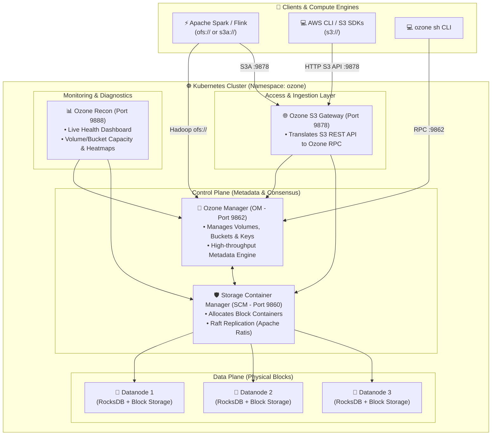

# 📦 Scalable Big Data Object Storage: Deploying Apache Ozone on Kubernetes

[](https://ozone.apache.org/)
[](#)
[](#)
[](https://kubernetes.io/)
[](https://kind.sigs.k8s.io/)

> **A complete step-by-step tutorial to deploy Apache Ozone (the next-generation, high-performance distributed object store for Hadoop & Spark) on your local Kubernetes cluster, access the Recon Web Dashboard, and read/write data using both the S3 Gateway and Ozone CLI.**

---

## 📑 Table of Contents

1. [What is Apache Ozone? (Why Replace HDFS?)](#1-what-is-apache-ozone-why-replace-hdfs)
2. [Ozone Architecture & Core Components](#2-ozone-architecture--core-components)
3. [Prerequisites](#3-prerequisites)
4. [Step 1: Deploy Apache Ozone with Kubernetes Manifests](#step-1-deploy-apache-ozone-with-kubernetes-manifests)
5. [Step 2: Verify Ozone Cluster Status](#step-2-verify-ozone-cluster-status)
6. [Step 3: Access the Ozone Recon Dashboard](#step-3-access-the-ozone-recon-dashboard)
7. [Step 4: Hands-On: Create Volumes, Buckets & Upload Files](#step-4-hands-on-create-volumes-buckets--upload-files)
   - [Method A: Using Native Ozone CLI](#method-a-using-native-ozone-cli)
   - [Method B: Using AWS S3 CLI with Ozone S3 Gateway](#method-b-using-aws-s3-cli-with-ozone-s3-gateway)
8. [Step 5: Connect Apache Spark to Apache Ozone](#step-5-connect-apache-spark-to-apache-ozone)
9. [Useful Ozone Administration Commands](#useful-ozone-administration-commands)
10. [Troubleshooting & Pro Tips](#troubleshooting--pro-tips)
11. [Cleanup](#11-cleanup)

---

## 1. What is Apache Ozone? (Why Replace HDFS?)

For over 15 years, **HDFS (Hadoop Distributed File System)** was the foundation of Big Data. However, HDFS has a fatal limitation:
- **The NameNode Scalability Bottleneck:** The HDFS NameNode stores all file metadata in heap RAM. When a cluster reaches **~400–500 million files**, the NameNode runs out of memory and crashes.
- **The Small Files Problem:** HDFS cannot handle billions of small objects efficiently.

```
┌─────────────────────────────────┐       ┌────────────────────────────────────────────────────────┐
│     HDFS (Legacy Architecture)  │  VS   │           Apache Ozone (Modern Architecture)           │
├─────────────────────────────────┤       ├────────────────────────────────────────────────────────┤
│ • Centralized NameNode bottleneck│       │ • Decoupled Namespace (OM) & Block Manager (SCM)      │
│ • Caps at ~400 Million files    │       │ • Scales easily to 10+ BILLION objects!                │
│ • Pure POSIX file system only   │       │ • Dual interface: S3 REST API + Hadoop ofs://         │
│ • Custom non-standard protocols │       │ • High-performance Raft consensus (Apache Ratis)      │
└─────────────────────────────────┘       └────────────────────────────────────────────────────────┘
```

**Apache Ozone** solves this by separating **Namespace Management** from **Block Storage**, allowing Big Data architectures to scale to billions of objects with Amazon S3 compatibility!

---

## 2. Ozone Architecture & Core Components



### Component Breakdown:
1. **OM (Ozone Manager):** Handles metadata (volumes, buckets, keys). Uses RocksDB internally for ultra-fast lookups.
2. **SCM (Storage Container Manager):** Manages datanodes, container lifecycle, and distributed block allocation.
3. **Datanodes:** Physical storage engines storing data chunks in 5GB containers replicated via Raft.
4. **S3 Gateway:** Stateless gateway exposing standard Amazon S3 REST APIs on port `9878`.
5. **Recon:** The monitoring and diagnostics dashboard on port `9888` (visualizes disk usage, missing containers, and cluster topology).

---

## 3. Prerequisites

Before starting, ensure you have:
- [x] A running **KinD cluster** (see [Local Kubernetes Setup Guide](../README.md)).
- [x] `kubectl` configured (`kubectl get nodes`).
- [x] At least **3 GB to 4 GB free RAM** allocated to Docker.

---

## Step 1: Deploy Apache Ozone with Kubernetes Manifests

Apply our complete, pre-configured manifest [`ozone-manifest.yaml`](ozone-manifest.yaml):

```bash
kubectl apply -f "k8 setup/apache-ozone/ozone-manifest.yaml"
```

---

## Step 2: Verify Ozone Cluster Status

Wait for all Ozone services to reach the `Running` state:

```bash
kubectl get pods -n ozone -w
```

**Expected output:**
```text
NAME                                READY   STATUS    RESTARTS   AGE
ozone-datanode-0                    1/1     Running   0          1m
ozone-manager-0                     1/1     Running   0          1m
ozone-recon-556bb4f79d-q87x2        1/1     Running   0          1m
ozone-s3g-7c78479b6d-w8q4s          1/1     Running   0          1m
ozone-scm-0                         1/1     Running   0          1m
```

---

## Step 3: Access the Ozone Recon Dashboard

### Option A: Using Ingress (Zero Port-Forward)
If you installed the Ingress Controller (see [Ingress Guide](../nginx-ingress/ingress_install.md)):
- Simply navigate to: **`http://ozone.local`** 🎉

### Option B: Using Port-Forwarding:
```bash
# Expose Recon Web Dashboard
kubectl port-forward -n ozone svc/ozone-recon 9888:9888

# Expose S3 Gateway (for S3 tools)
kubectl port-forward -n ozone svc/ozone-s3g 9878:9878
```

Open your browser to: **`http://localhost:9888`**
You will see the **Apache Ozone Recon Dashboard** with:
- Total Cluster Capacity & Available Storage
- Healthy Datanodes Count
- Volumes, Buckets, and Keys analytics

---

## Step 4: Hands-On: Create Volumes, Buckets & Upload Files

In Ozone, data is hierarchically organized as:
```text
Volume ➔ Bucket ➔ Key (Object)
```

### Method A: Using Native Ozone CLI

Open an interactive shell inside the Ozone Manager pod:

```bash
kubectl exec -it -n ozone ozone-manager-0 -- /bin/bash
```

Inside the pod:
```bash
# 1. Create a Volume for data engineering
ozone sh volume create /analytics

# 2. Create a Bucket inside the volume
ozone sh bucket create /analytics/telemetry

# 3. Create a test sample file
echo "Apache Ozone is awesome for Big Data and Kubernetes!" > /tmp/sample.txt

# 4. Upload the file (Key) to Ozone
ozone sh key put /analytics/telemetry/data.txt /tmp/sample.txt

# 5. List keys and read the content
ozone sh key list /analytics/telemetry
ozone sh key cat /analytics/telemetry/data.txt

# Exit pod
exit
```

---

### Method B: Using AWS S3 CLI with Ozone S3 Gateway

Because Ozone includes a built-in **S3 Gateway**, you can interact with it using standard AWS tools:

```bash
# Set dummy credentials (default local mode)
export AWS_ACCESS_KEY_ID=test
export AWS_SECRET_ACCESS_KEY=test

# List S3 buckets in Ozone
aws --endpoint-url http://localhost:9878 s3 ls

# Create a new bucket via S3 API
aws --endpoint-url http://localhost:9878 s3 mb s3://spark-data

# Upload a local file via S3 API
aws --endpoint-url http://localhost:9878 s3 cp "k8 setup/kind-config.yaml" s3://spark-data/kind-config.yaml

# Download the file back
aws --endpoint-url http://localhost:9878 s3 cp s3://spark-data/kind-config.yaml downloaded-test.yaml
```

---

## Step 5: Connect Apache Spark to Apache Ozone

In production, **Apache Spark reads and writes directly to Apache Ozone** via the `ofs://` (Ozone File System) protocol or `s3a://`:

### PySpark Example connecting to Ozone:

```python
from pyspark.sql import SparkSession

spark = SparkSession.builder     .appName("OzoneSparkIntegration")     .config("spark.hadoop.fs.defaultFS", "ofs://ozone-manager.ozone.svc.cluster.local/")     .getOrCreate()

# Create sample DataFrame
data = [("Laptop", 1200), ("Monitor", 300), ("Keyboard", 75)]
df = spark.createDataFrame(data, ["Product", "Price"])

# Write directly into Apache Ozone Bucket in Parquet format!
df.write.parquet("ofs://ozone-manager.ozone.svc.cluster.local/analytics/telemetry/products.parquet")

# Read it back
read_df = spark.read.parquet("ofs://ozone-manager.ozone.svc.cluster.local/analytics/telemetry/products.parquet")
read_df.show()
```

---

## Useful Ozone Administration Commands

| Task | Command |
| :--- | :--- |
| **Check SCM cluster health** | `kubectl exec -it -n ozone ozone-scm-0 -- ozone admin scm status` |
| **List active Datanodes** | `kubectl exec -it -n ozone ozone-scm-0 -- ozone admin datanode list` |
| **List all Volumes** | `kubectl exec -it -n ozone ozone-manager-0 -- ozone sh volume list` |
| **Inspect S3 Gateway logs** | `kubectl logs -f -n ozone -l app=ozone-s3g` |
| **View Recon analytics** | Access `http://localhost:9888/insights` |

---

## Troubleshooting & Pro Tips

> [!WARNING]
> **Error: "OM not initialized / SCM not found" on startup:**  
> When first spinning up, Storage Container Manager (SCM) must initialize before Ozone Manager (OM) starts. Our manifest automatically includes init scripts and retry logic. If a pod crashes on initial pull, wait 30 seconds for the self-healing retry.

> [!TIP]
> **Replication Factor in Local KinD:**  
> In production, Ozone replicates data across **3 Datanodes (Ratis/THREE)**. In a local single-node KinD cluster, set the default replication to **`1 (ONE)`** to conserve memory:
> ```xml
> <property>
>   <name>dfs.replication</name>
>   <value>1</value>
> </property>
> ```

---

## Cleanup

To completely remove Apache Ozone from your cluster:
```bash
kubectl delete -f "k8 setup/apache-ozone/ozone-manifest.yaml"
```
