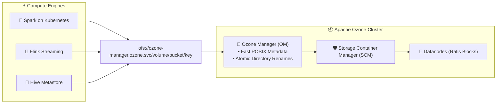
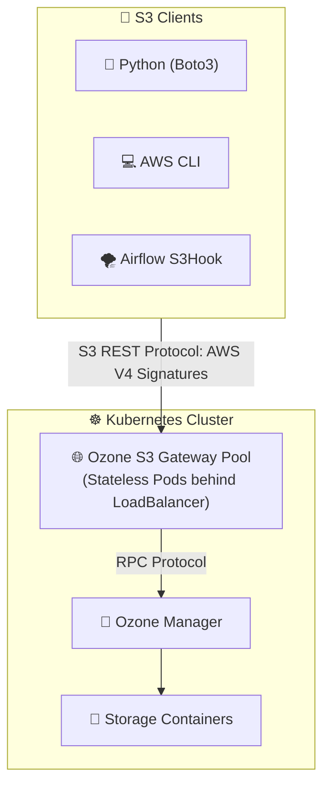
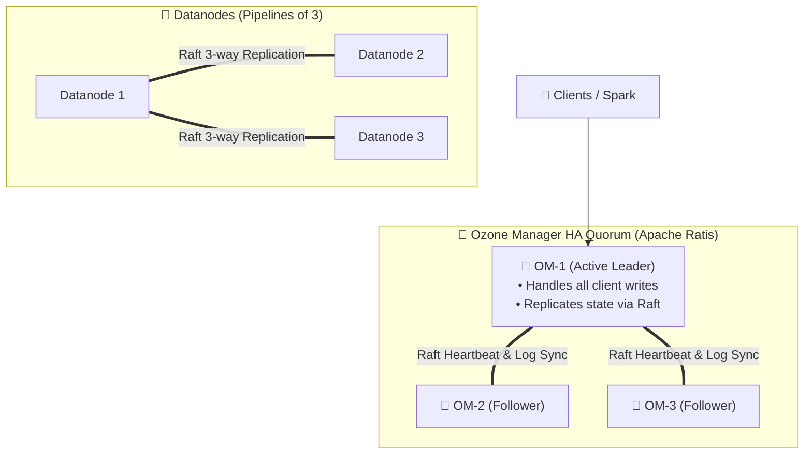

# 🌐 Enterprise Big Data Storage: Apache Ozone Production Architecture & Access Patterns

[](https://ozone.apache.org/)
[](#)
[](#)
[](#)

> **An architectural deep dive into how Apache Ozone operates in multi-petabyte enterprise Data Lakes: HDFS replacement, Hadoop ofs:// protocols, S3 Gateway multi-tenancy, Ratis consensus HA, and Apache Ranger security.**

---

## 📑 Table of Contents

1. [The Storage Evolution: HDFS vs. Cloud S3 vs. Apache Ozone](#1-the-storage-evolution-hdfs-vs-cloud-s3-vs-apache-ozone)
2. [Pattern 1: Hadoop Compatible Filesystem (`ofs://` & `o3fs://`)](#2-pattern-1-hadoop-compatible-filesystem-ofs-o3fs)
3. [Pattern 2: S3 Gateway with Multi-Tenant Access Keys](#3-pattern-2-s3-gateway-with-multi-tenant-access-keys)
4. [Pattern 3: High Availability via Apache Ratis (Raft Consensus)](#4-pattern-3-high-availability-via-apache-ratis-raft-consensus)
5. [Pattern 4: Enterprise Security (Kerberos & Apache Ranger)](#5-pattern-4-enterprise-security-kerberos--apache-ranger)
6. [Pattern 5: Connecting Trino / Presto & Hive to Ozone](#6-pattern-5-connecting-trino--presto--hive-to-ozone)
7. [Summary Comparison Table](#7-summary-comparison-table)

---

## 1. The Storage Evolution: HDFS vs. Cloud S3 vs. Apache Ozone

```
┌─────────────────────────┬─────────────────────────┬─────────────────────────┐
│ Feature                 │ HDFS (Legacy Hadoop)    │ AWS S3 / MinIO          │ Apache Ozone (Modern)   │
├─────────────────────────┼─────────────────────────┼─────────────────────────┤
│ Max Object Limit        │ ~400–500 Million files  │ Unlimited               │ 10+ Billion objects     │
│ Small File Performance  │ Terrible (RAM hog)      │ Good                    │ Excellent (RocksDB OM)  │
│ Atomic Directory Rename │ Yes (O(1) fast rename)  │ No (Costly copy & delete│ Yes (Full POSIX ofs://) │
│ Compute Locality        │ Yes                     │ No                      │ Yes (K8s / Bare-metal)  │
│ Protocol Compatibility  │ Hadoop only             │ S3 REST only            │ Dual: S3 API + Hadoop   │
└─────────────────────────┴─────────────────────────┴─────────────────────────┘
```

---

## 2. Pattern 1: Hadoop Compatible Filesystem (`ofs://` & `o3fs://`)

For data processing engines like **Apache Spark, Apache Flink, and Hive**, Ozone exposes the native Hadoop Filesystem interface:



### `ofs://` vs. `o3fs://`:
- **`ofs://` (Root-level File System):** Allows viewing and navigating across **all Volumes and Buckets** just like a standard Linux directory tree (`/volume1/bucketA/file.parquet`).
- **`o3fs://` (Bucket-scoped File System):** Scoped to a single bucket (equivalent to legacy `hdfs://`).

---

## 3. Pattern 2: S3 Gateway with Multi-Tenant Access Keys

In modern Data Platforms, applications ingest data via standard Amazon S3 SDKs:



### Multi-Tenant Key Generation:
Ozone administrators generate S3 Access Keys for teams without creating cloud accounts:
```bash
# Generate S3 credentials for an analytics user
ozone s3 getsecret -u data_engineer_alice
# Output:
# awsAccessKey=data_engineer_alice
# awsSecret=3f98a7c8e8b91234567890abcdef
```

---

## 4. Pattern 3: High Availability via Apache Ratis (Raft Consensus)

In production, both **Ozone Manager (OM)** and **Storage Container Manager (SCM)** operate in **High Availability (HA)** quorums using **Apache Ratis** (open-source Raft implementation in Java):



- If `OM-1` crashes, `OM-2` is elected leader in **less than 3 seconds** with zero data loss!

---

## 5. Pattern 4: Enterprise Security (Kerberos & Apache Ranger)

In Fortune 500 banks and healthcare companies, storage must be secured with:
1. **Kerberos Authentication:** Proves the identity of every user, pod, and service ticket.
2. **Apache Ranger Authorization:** Fine-grained access control policies:
   - Volume, Bucket, and Key-level permissions.
   - Column-level masking and row-level filtering.
3. **mTLS In-Transit Encryption:** All internal RPC traffic between OM, SCM, and Datanodes is encrypted via TLS.

---

## 6. Pattern 5: Connecting Trino / Presto & Hive to Ozone

To query Parquet / ORC datasets stored in Ozone using SQL at lightning speeds:

### Trino Hive Catalog Configuration (`hive.properties`):
```properties
connector.name=hive
hive.metastore.uri=thrift://hive-metastore.data.svc:9083
hive.config.resources=/etc/hadoop/conf/core-site.xml,/etc/hadoop/conf/ozone-site.xml
```

SQL query in Trino directly against Ozone:
```sql
SELECT 
    customer_id, 
    SUM(order_amount) AS total_revenue 
FROM hive.analytics.orders 
-- Data stored in: ofs://ozone-manager.ozone.svc/analytics/orders/
GROUP BY customer_id 
ORDER BY total_revenue DESC 
LIMIT 10;
```

---

## 7. Summary Comparison Table

| Pattern | Interface | Best Used For |
| :--- | :--- | :--- |
| **`ofs://` Protocol** | Native Hadoop Java API | Apache Spark, Flink, and Hive ETL workloads. |
| **S3 Gateway** | Amazon S3 REST API | Web applications, Python Boto3, Airflow, and Cloud tools. |
| **Ratis HA Quorum** | Raft Consensus | Mission-critical 99.999% uptime metadata availability. |
| **Recon Dashboard** | Web UI (Port 9888) | Cluster health, container balancing, and capacity inspection. |
