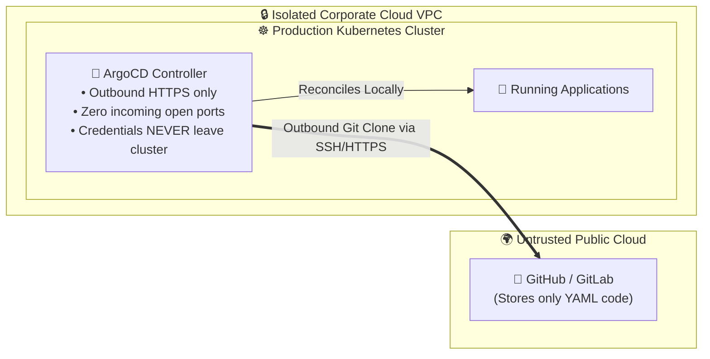
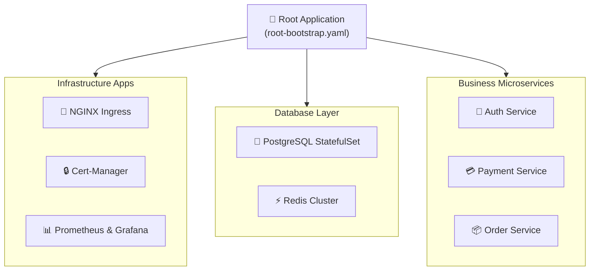
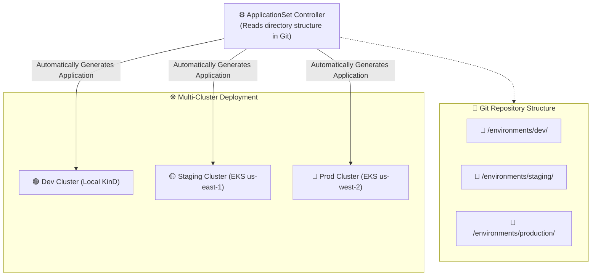
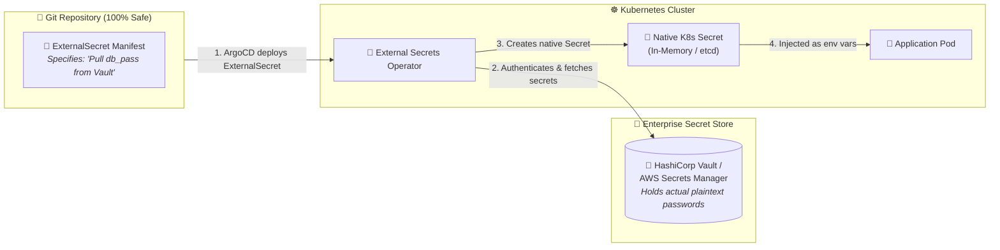
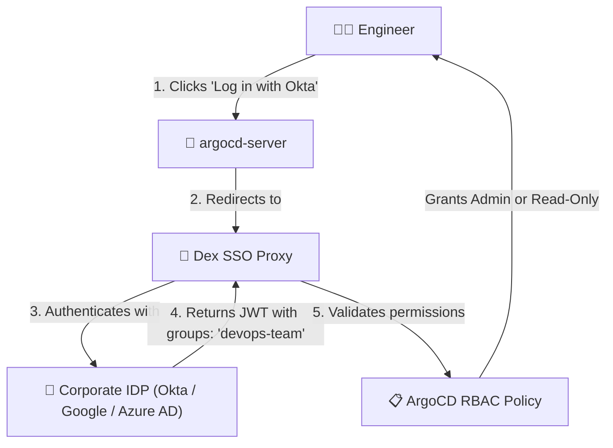

# 🌐 Enterprise GitOps: ArgoCD Production Architecture, Patterns & Security

[](https://argo-cd.readthedocs.io/)
[](#)
[](#)
[](#)

> **An architectural deep dive into how ArgoCD is designed, scaled, and secured in enterprise multi-cluster production environments: App-of-Apps pattern, ApplicationSet, secret management (Vault/External Secrets), Enterprise SSO, and High-Availability (HA).**

---

## 📑 Table of Contents

1. [Push CI/CD vs. Pull GitOps: The Security Paradigm Shift](#1-push-cicd-vs-pull-gitops-the-security-paradigm-shift)
2. [Pattern 1: The App-of-Apps Pattern](#2-pattern-1-the-app-of-apps-pattern)
3. [Pattern 2: Multi-Cluster & Multi-Env with ApplicationSet](#3-pattern-2-multi-cluster--multi-env-with-applicationset)
4. [Pattern 3: Secret Management in GitOps (External Secrets & Vault)](#4-pattern-3-secret-management-in-gitops-external-secrets--vault)
5. [Pattern 4: Enterprise Identity, SSO & RBAC (Dex / Okta / GitHub)](#5-pattern-4-enterprise-identity-sso--rbac-dex--okta--github)
6. [Pattern 5: High-Availability (HA) ArgoCD Architecture](#6-pattern-5-high-availability-ha-argocd-architecture)
7. [Pattern 6: Instant Deployments via GitHub Webhooks](#7-pattern-6-instant-deployments-via-github-webhooks)
8. [Summary Reference Table](#8-summary-reference-table)

---

## 1. Push CI/CD vs. Pull GitOps: The Security Paradigm Shift

In traditional CI/CD (GitHub Actions, GitLab CI, Jenkins), your CI pipeline must hold **Cluster Admin credentials** to execute `kubectl apply`:

```
⚠️ TRADITIONAL PUSH (Security Vulnerability):
GitHub Actions Runner  ──[ Holds AWS/Kubeconfig Credentials ]──>  Pushes to K8s API
If your GitHub token is leaked or CI runner is breached, your entire production cluster is compromised!
```

**GitOps (Pull) solves this completely:**



---

## 2. Pattern 1: The App-of-Apps Pattern

In large enterprise architectures with dozens of microservices, creating individual `Application` CRDs manually is unmaintainable.

The **App-of-Apps** pattern uses a single "Root Application" that manages a tree of child applications:



### Root Bootstrap Manifest:

```yaml
# root-bootstrap.yaml
apiVersion: argoproj.io/v1alpha1
kind: Application
metadata:
  name: platform-root
  namespace: argocd
  finalizers:
    - resources-finalizer.argocd.argoproj.io
spec:
  project: default
  source:
    repoURL: "https://github.com/my-org/gitops-manifests.git"
    targetRevision: main
    path: "apps" # Directory containing all child Application YAMLs
  destination:
    server: "https://kubernetes.default.svc"
    namespace: argocd
  syncPolicy:
    automated:
      prune: true
      selfHeal: true
```

---

## 3. Pattern 2: Multi-Cluster & Multi-Env with ApplicationSet

How do you deploy the same application across `dev`, `staging`, and `production` clusters without duplicating YAML code?

Using the **`ApplicationSet`** controller with a **Git Generator**:



### ApplicationSet Manifest:

```yaml
# multi-env-appset.yaml
apiVersion: argoproj.io/v1alpha1
kind: ApplicationSet
metadata:
  name: microservice-deployments
  namespace: argocd
spec:
  generators:
    - list:
        elements:
          - env: dev
            cluster: "https://kubernetes.default.svc"
            targetRevision: develop
          - env: staging
            cluster: "https://staging-k8s.mycompany.internal"
            targetRevision: main
          - env: production
            cluster: "https://prod-k8s.mycompany.internal"
            targetRevision: main
  template:
    metadata:
      name: "{{env}}-ecommerce-api"
    spec:
      project: default
      source:
        repoURL: "https://github.com/my-org/ecommerce-api.git"
        targetRevision: "{{targetRevision}}"
        path: "k8s/overlays/{{env}}"
      destination:
        server: "{{cluster}}"
        namespace: "{{env}}"
      syncPolicy:
        automated:
          prune: true
          selfHeal: true
```

---

## 4. Pattern 3: Secret Management in GitOps (External Secrets & Vault)

> ⚠️ **The GitOps Golden Rule:**  
> **NEVER commit unencrypted secrets, API tokens, or database passwords to Git!**

### Industry Standard Solution: External Secrets Operator (ESO) + HashiCorp Vault



---

## 5. Pattern 4: Enterprise Identity, SSO & RBAC (Dex / Okta / GitHub)

In enterprise production, developers do not share the default `admin` password. Access is gated by **Single Sign-On (SSO)** and strict **RBAC (Role-Based Access Control)**.



### Production RBAC Policy ConfigMap:

```yaml
apiVersion: v1
kind: ConfigMap
metadata:
  name: argocd-rbac-cm
  namespace: argocd
data:
  policy.default: role:readonly # Default is safe read-only
  policy.csv: |
    # Grant DevOps engineers full cluster admin privileges
    g, "corporate-devops-group", role:admin
    
    # Developers can sync apps in development, but only view production
    p, role:developer, applications, sync, dev/*, allow
    p, role:developer, applications, get, *, allow
    g, "corporate-developers-group", role:developer
```

---

## 6. Pattern 5: High-Availability (HA) ArgoCD Architecture

For production environments managing hundreds of clusters, deploy the HA configuration:

```
┌─────────────────────────────────┐       ┌────────────────────────────────────────────────────────┐
│     Component                   │       │     High-Availability (HA) Production Setup            │
├─────────────────────────────────┤       ├────────────────────────────────────────────────────────┤
│ argocd-server                   │       │ 3 replicas with HorizontalPodAutoscaler (HPA)          │
│ argocd-repo-server              │       │ 3–5 replicas with dedicated Git clone PVCs             │
│ argocd-redis                    │       │ Redis Sentinel with 1 Master + 2 Replicas              │
│ argocd-application-controller   │       │ Active-Standby with dynamic shard distribution        │
└─────────────────────────────────┘       └────────────────────────────────────────────────────────┘
```

---

## 7. Pattern 6: Instant Deployments via GitHub Webhooks

By default, ArgoCD polls Git every **3 minutes** (`timeout.reconciliation = 180s`). To make deployments instantaneous on every `git push`:

1. Expose ArgoCD Webhook URL via Ingress: `https://argocd.mycompany.com/api/webhook`.
2. In GitHub ➔ **Repository Settings** ➔ **Webhooks** ➔ **Add Webhook**:
   - **Payload URL:** `https://argocd.mycompany.com/api/webhook`
   - **Content type:** `application/json`
   - **Secret:** Configure shared webhook secret
   - **Events:** Just the `push` event.
3. Every commit triggers an instant zero-second reconciliation! ⚡

---

## 8. Summary Reference Table

| Pattern | Problem It Solves | Production Standard |
| :--- | :--- | :--- |
| **App-of-Apps** | Managing hundreds of independent microservices. | Single bootstrap root application. |
| **ApplicationSet** | Deploying across multi-cloud, multi-cluster, and dev/prod. | Dynamic Git Directory & List generators. |
| **External Secrets** | Storing passwords securely without committing them to Git. | External Secrets Operator (ESO) + Vault/AWS SM. |
| **Dex SSO & RBAC** | Preventing unauthorized cluster modifications. | Okta / Google Workspace SSO + group RBAC. |
| **Git Webhooks** | Eliminating the 3-minute Git polling latency. | Direct GitHub / GitLab webhook push notification. |
