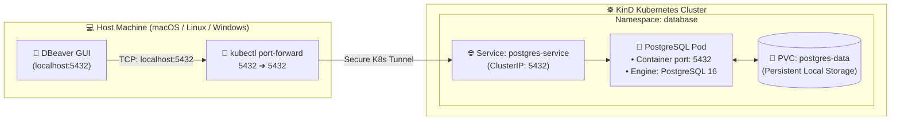

# 🐘 Deploying PostgreSQL on Kubernetes & Connecting via DBeaver

[](https://www.postgresql.org/)
[](https://kubernetes.io/)
[](https://helm.sh/)
[](https://dbeaver.io/)
[](https://kind.sigs.k8s.io/)

> **A complete step-by-step tutorial to deploy a persistent PostgreSQL database on your local Kubernetes (KinD) cluster and securely connect to it from your host machine using DBeaver GUI.**

---

## 📑 Table of Contents

1. [Architecture & Connection Flow](#1-architecture--connection-flow)
2. [Prerequisites](#2-prerequisites)
3. [Method 1: Deploy with Helm (Bitnami - Recommended)](#method-1-deploy-with-helm-bitnami---recommended)
   - [Step 1: Add Bitnami Helm Repo](#step-1-add-bitnami-helm-repo)
   - [Step 2: Create Custom values.yaml](#step-2-create-custom-valuesyaml)
   - [Step 3: Deploy PostgreSQL](#step-3-deploy-postgresql)
4. [Method 2: Deploy with Plain Kubernetes Manifests](#method-2-deploy-with-plain-kubernetes-manifests)
   - [Step 1: Namespace & Secret](#step-1-namespace--secret)
   - [Step 2: PersistentVolumeClaim (PVC)](#step-2-persistentvolumeclaim-pvc)
   - [Step 3: Deployment & Service](#step-3-deployment--service)
5. [Step 4: Verify Deployment & Database Health](#step-4-verify-deployment--database-health)
6. [Step 5: Expose PostgreSQL to Your Host Machine](#step-5-expose-postgresql-to-your-host-machine)
7. [Step 6: Connect from DBeaver](#step-6-connect-from-dbeaver)
   - [1. Install DBeaver](#1-install-dbeaver)
   - [2. Configure Connection](#2-configure-connection)
   - [3. Test & Execute Queries](#3-test--execute-queries)
8. [Useful Postgres Admin Commands](#useful-postgres-admin-commands)
9. [Troubleshooting & Pro Tips](#troubleshooting--pro-tips)
10. [Cleanup](#cleanup)

---

## 1. Architecture & Connection Flow



---

## 2. Prerequisites

Before starting, ensure you have:
- [x] A running **Kind cluster** (see [Local Kubernetes Setup Guide](README.md)).
- [x] `kubectl` configured and connected (`kubectl get nodes`).
- [x] `helm` installed (v3+).
- [x] **DBeaver Community Edition** installed on your host machine ([Download DBeaver](https://dbeaver.io/download/)).

---

## Method 1: Deploy with Helm (Bitnami - Recommended)

The Bitnami PostgreSQL chart is the production standard for running PostgreSQL on Kubernetes, featuring automated password handling, persistence, and health probes.

### Step 1: Add Bitnami Helm Repo

```bash
helm repo add bitnami https://charts.bitnami.com/bitnami
helm repo update
```

### Step 2: Create Custom `values.yaml`

Create a file named `postgres-values.yaml` with your custom credentials and configuration:

```yaml
# postgres-values.yaml
global:
  postgresql:
    auth:
      username: "admin"
      password: "SuperSecretPassword123!"
      database: "analytics_db"
      postgresPassword: "RootSecretPassword123!"

primary:
  persistence:
    enabled: true
    size: 5Gi
  resources:
    requests:
      cpu: 250m
      memory: 256Mi
    limits:
      cpu: 1000m
      memory: 1Gi
```

### Step 3: Deploy PostgreSQL

Deploy into a dedicated `database` namespace:

```bash
# Create namespace
kubectl create namespace database

# Deploy PostgreSQL via Helm
helm install postgres bitnami/postgresql   --namespace database   -f postgres-values.yaml
```

**Output:**
```text
NAME: postgres
LAST DEPLOYED: ...
NAMESPACE: database
STATUS: deployed
REVISION: 1
TEST SUITE: None
NOTES:
CHART NAME: postgresql
...
```

---

## Method 2: Deploy with Plain Kubernetes Manifests

If you prefer pure Kubernetes YAML manifests without Helm, use this complete, production-grade manifest.

Save the following as `postgres-manifest.yaml`:

```yaml
# postgres-manifest.yaml
apiVersion: v1
kind: Namespace
metadata:
  name: database
---
apiVersion: v1
kind: Secret
metadata:
  name: postgres-secret
  namespace: database
type: Opaque
stringData:
  POSTGRES_DB: "analytics_db"
  POSTGRES_USER: "admin"
  POSTGRES_PASSWORD: "SuperSecretPassword123!"
---
apiVersion: v1
kind: PersistentVolumeClaim
metadata:
  name: postgres-pvc
  namespace: database
spec:
  accessModes:
    - ReadWriteOnce
  resources:
    requests:
      storage: 5Gi
---
apiVersion: apps/v1
kind: Deployment
metadata:
  name: postgres-deployment
  namespace: database
spec:
  replicas: 1
  selector:
    matchLabels:
      app: postgres
  template:
    metadata:
      labels:
        app: postgres
    spec:
      containers:
        - name: postgres
          image: postgres:16-alpine
          ports:
            - containerPort: 5432
              name: postgres
          envFrom:
            - secretRef:
                name: postgres-secret
          resources:
            requests:
              cpu: 200m
              memory: 256Mi
            limits:
              cpu: 500m
              memory: 512Mi
          volumeMounts:
            - name: postgres-storage
              mountPath: /var/lib/postgresql/data
              subPath: pgdata
          readinessProbe:
            exec:
              command: ["psql", "-U", "admin", "-d", "analytics_db", "-c", "SELECT 1"]
            initialDelaySeconds: 5
            periodSeconds: 10
          livenessProbe:
            exec:
              command: ["psql", "-U", "admin", "-d", "analytics_db", "-c", "SELECT 1"]
            initialDelaySeconds: 15
            periodSeconds: 20
      volumes:
        - name: postgres-storage
          persistentVolumeClaim:
            claimName: postgres-pvc
---
apiVersion: v1
kind: Service
metadata:
  name: postgres-service
  namespace: database
spec:
  type: ClusterIP
  selector:
    app: postgres
  ports:
    - port: 5432
      targetPort: 5432
```

Apply the manifest:
```bash
kubectl apply -f postgres-manifest.yaml
```

---

## Step 4: Verify Deployment & Database Health

### 1. Check Pod Status
Wait until the Pod status turns `Running` and `Ready (1/1)`:

```bash
kubectl get pods -n database
```

**Expected output:**
```text
NAME                                  READY   STATUS    RESTARTS   AGE
postgres-postgresql-0                 1/1     Running   0          45s
# OR for Method 2:
# postgres-deployment-64d898495-x8q7w 1/1     Running   0          45s
```

### 2. Verify Persistent Volume Claim (PVC)
Ensure the storage is successfully bound:

```bash
kubectl get pvc -n database
```

**Expected output:**
```text
NAME                  STATUS   VOLUME                                     CAPACITY   ACCESS MODES   STORAGECLASS   AGE
data-postgres-postgresql-0 Bound    pvc-874f63c8-e8cb-465d-b2b9-29cba5312345   5Gi        RWO            standard       1m
```

### 3. Test In-Cluster Connectivity with `psql`

Run an interactive shell directly in the Pod:

```bash
# If using Helm (Bitnami):
kubectl exec -it -n database postgres-postgresql-0 -- psql -U admin -d analytics_db

# If using Plain Manifest:
kubectl exec -it -n database deploy/postgres-deployment -- psql -U admin -d analytics_db
```

Inside PostgreSQL prompt:
```sql
SELECT version();
\q
```

---

## Step 5: Expose PostgreSQL to Your Host Machine

Kubernetes pods live inside an isolated internal cluster network (`10.244.x.x`). To access the database from DBeaver running on your host OS, use `kubectl port-forward`:

### Run Port-Forwarding:

```bash
# For Helm deployment:
kubectl port-forward -n database svc/postgres-postgresql 5432:5432

# For Plain Manifest deployment:
kubectl port-forward -n database svc/postgres-service 5432:5432
```

**Expected output:**
```text
Forwarding from 127.0.0.1:5432 -> 5432
Forwarding from [::1]:5432 -> 5432
```

> [!WARNING]
> **Port 5432 already in use?**  
> If you already have a PostgreSQL instance running locally on your computer, map to a different host port such as `5433`:
> ```bash
> kubectl port-forward -n database svc/postgres-postgresql 5433:5432
> ```
> *(Remember to use port `5433` in DBeaver!)*

> [!TIP]
> Keep this terminal open! Alternatively, run in background:
> ```bash
> kubectl port-forward -n database svc/postgres-postgresql 5432:5432 > /dev/null 2>&1 &
> ```

---

## Step 6: Connect from DBeaver

### 1. Install DBeaver
If you don't have DBeaver yet:
- **macOS:** `brew install --cask dbeaver-community`
- **Windows:** `winget install dbeaver.dbeaver` or `choco install dbeaver`
- **Linux (Ubuntu/Debian):** `sudo snap install dbeaver-ce`

### 2. Configure Connection

1. Open **DBeaver**.
2. Click **Database** in the top menu bar ➔ **New Database Connection** (or click the plug icon with the green plus `+`).
3. Select **PostgreSQL** and click **Next**.
4. Fill in the connection settings:

| Field | Value | Notes |
| :--- | :--- | :--- |
| **Host** | `localhost` (or `127.0.0.1`) | Connected via port-forward |
| **Port** | `5432` | *(Or `5433` if you remapped)* |
| **Database** | `analytics_db` | Configured in values/manifest |
| **Authentication** | `Database Native` | Default |
| **Username** | `admin` | *(Or `postgres` for superuser)* |
| **Password** | `SuperSecretPassword123!` | Defined in our values/manifest |

```
┌──────────────────────────────────────────────────────────────┐
│                    DBeaver Connection Dialog                 │
├──────────────────────────────────────────────────────────────┤
│  Host:         [ localhost                  ] Port: [ 5432 ] │
│  Database:     [ analytics_db                              ] │
│  Username:     [ admin                                     ] │
│  Password:     [ ••••••••••••••••••••••                    ] │
│                                                              │
│  [ Test Connection ... ]                     [ Finish ]      │
└──────────────────────────────────────────────────────────────┘
```

5. Click **"Test Connection ..."**:
   - If prompted to download the PostgreSQL JDBC Driver, click **Download**.
   - You should see a success popup:  
     `✅ Connected (PostgreSQL 16.x, Driver: PostgreSQL JDBC Driver)`
6. Click **Finish**.

---

### 3. Test & Execute Queries

1. Expand your new connection in the Database Navigator on the left.
2. Press **`F3`** (or right-click ➔ **SQL Editor** ➔ **Open SQL Script**).
3. Paste and run this test script:

```sql
-- 1. Create a sample schema and table
CREATE SCHEMA IF NOT EXISTS ecommerce;

CREATE TABLE ecommerce.customers (
    customer_id SERIAL PRIMARY KEY,
    name VARCHAR(100) NOT NULL,
    email VARCHAR(150) UNIQUE NOT NULL,
    signup_date TIMESTAMP DEFAULT CURRENT_TIMESTAMP,
    total_spend NUMERIC(10, 2) DEFAULT 0.00
);

-- 2. Insert sample test records
INSERT INTO ecommerce.customers (name, email, total_spend) VALUES
('Alice Johnson', 'alice@example.com', 1250.50),
('Bob Smith', 'bob@example.com', 450.00),
('Charlie Brown', 'charlie@example.com', 89.99),
('Diana Prince', 'diana@example.com', 3420.75);

-- 3. Query the data
SELECT 
    customer_id,
    name,
    email,
    total_spend,
    CASE 
        WHEN total_spend > 1000 THEN 'VIP'
        ELSE 'Regular'
    END AS customer_tier
FROM ecommerce.customers
ORDER BY total_spend DESC;
```

Press **`Ctrl + Enter`** (or `Cmd + Enter` on macOS) to execute. You will see the customer query results in the DBeaver data grid! 🚀

---

## Useful Postgres Admin Commands

### Retrieve Generated Helm Password (if default Helm password was used)
```bash
export POSTGRES_PASSWORD=$(kubectl get secret --namespace database postgres-postgresql -o jsonpath="{.data.postgres-password}" | base64 -d)
echo "Password: $POSTGRES_PASSWORD"
```

### Backup Database to Host Machine (pg_dump)
```bash
# Stream dump directly to a local file
kubectl exec -n database postgres-postgresql-0 -- pg_dump -U admin -d analytics_db > backup_$(date +%F).sql
```

### Restore Database from Host Machine
```bash
cat backup_2026-09-26.sql | kubectl exec -i -n database postgres-postgresql-0 -- psql -U admin -d analytics_db
```

### View Live Database Logs
```bash
kubectl logs -f -n database -l app.kubernetes.io/name=postgresql
```

---

## Troubleshooting & Pro Tips

> [!WARNING]
> **Error: "Connection refused: localhost:5432"**  
> 1. Ensure `kubectl port-forward` is actively running in a terminal.
> 2. Check if the Pod is healthy: `kubectl get pods -n database`. If it is in `CrashLoopBackOff`, run `kubectl logs -n database <pod-name>`.

> [!WARNING]
> **Error: "FATAL: password authentication failed for user"**  
> 1. Double-check username: By default Bitnami creates an `admin` user if specified, or `postgres` if not.
> 2. Verify password directly in the secret:
>    ```bash
>    kubectl get secret postgres -n database -o jsonpath="{.data.admin-password}" | base64 -d
>    ```

> [!TIP]
> **Data Persistence in KinD:**  
> Because we used a `PersistentVolumeClaim`, your data will survive Pod restarts and crashes. However, if you run `kind delete cluster`, the underlying Docker containers and volumes will be wiped. For permanent data, consider using host-path mounts in `kind-config.yaml`.

---

## Cleanup

To completely remove PostgreSQL and its storage from your cluster:

### If using Helm:
```bash
helm uninstall postgres -n database
kubectl delete pvc --all -n database
kubectl delete namespace database
```

### If using Manifests:
```bash
kubectl delete -f postgres-manifest.yaml
```

---

## 🧭 Production Deep Dive

Wondering how databases are accessed in real production (where `kubectl port-forward` is forbidden)?

👉 **Read the comprehensive guide:** [🌐 Production Database Access Patterns & Kubernetes Networking](production_access_patterns.md)  
Learn about:
- In-Cluster Service-to-Service DNS (`ClusterIP`)
- Remote DBeaver access via **Bastion Host / SSH Tunneling**
- Corporate **Zero-Trust VPNs (Tailscale / ZTNA)**
- Kubernetes Database Operators (**CloudNativePG**) vs Cloud-Managed DBs (AWS RDS / GCP Cloud SQL)
- NetworkPolicies, Secrets management, and Connection Pooling (PgBouncer)
