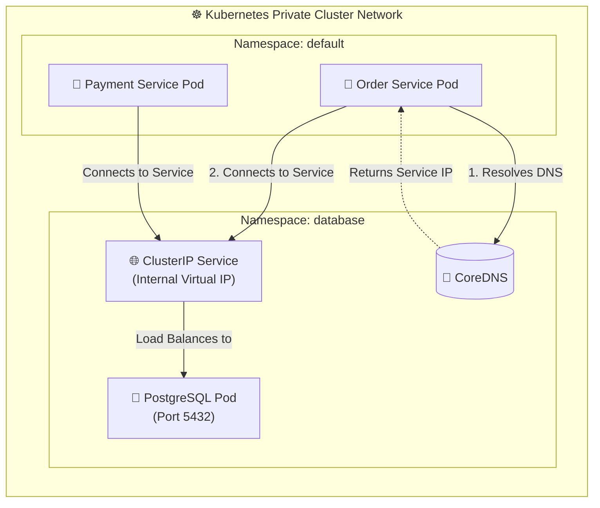
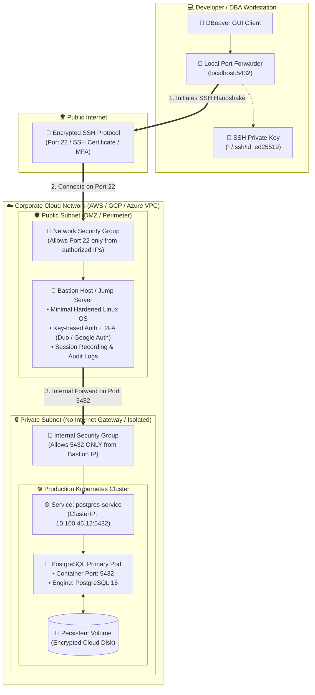
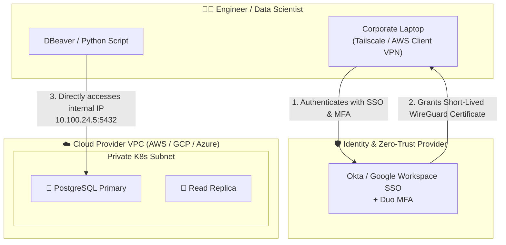
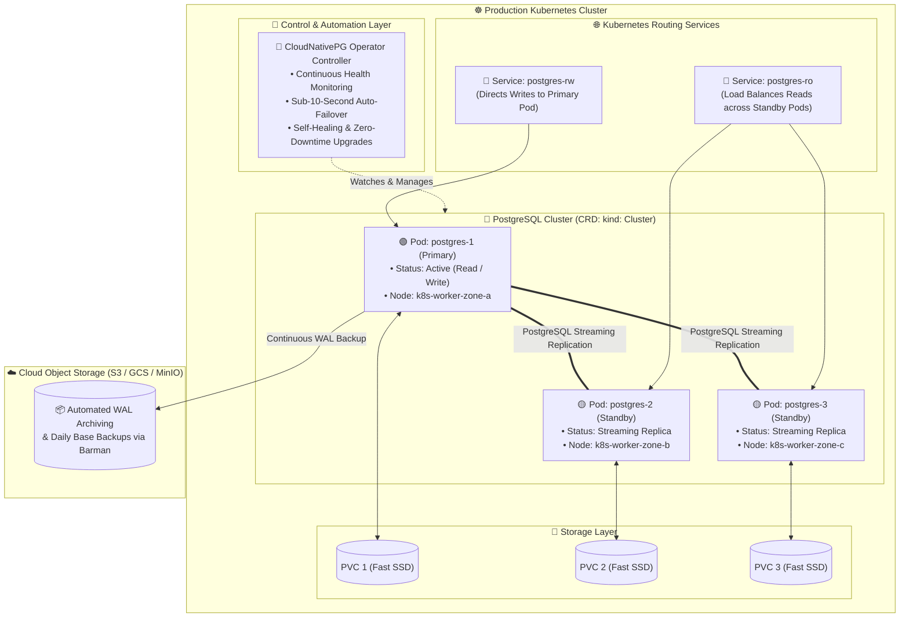
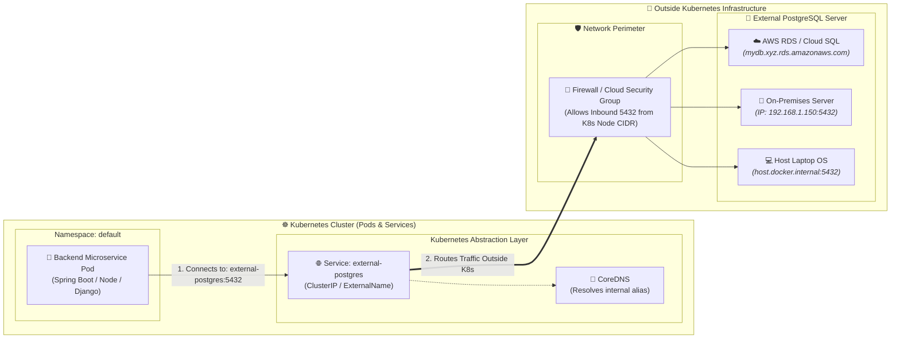
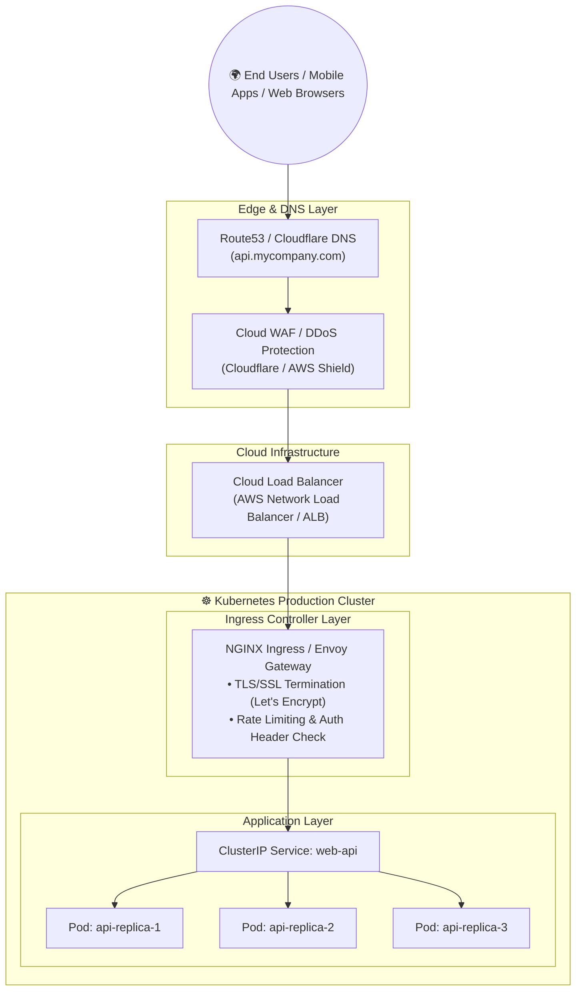

# 🌐 Production Database Access Patterns & Kubernetes Networking

[](https://kubernetes.io/)
[](https://www.postgresql.org/)
[](#)
[](https://dbeaver.io/)

> **A deep dive into how databases and applications are actually accessed, secured, and networked in real-world production Kubernetes environments vs. local development (`kubectl port-forward`).**

---

## 📑 Table of Contents

1. [Local Dev (`port-forward`) vs. Real Production](#1-local-dev-port-forward-vs-real-production)
2. [Pattern 1: Internal Service-to-Service (Backend ➔ Database)](#2-pattern-1-internal-service-to-service-backend--database)
3. [Pattern 2: Bastion Host / Jump Server (SSH Tunneling for DBeaver)](#3-pattern-2-bastion-host--jump-server-ssh-tunneling-for-dbeaver)
4. [Pattern 3: Corporate VPN / Zero-Trust Network Access (ZTNA)](#4-pattern-3-corporate-vpn--zero-trust-network-access-ztna)
5. [Pattern 4: Cloud Managed Databases vs. Kubernetes In-Cluster Databases](#5-pattern-4-cloud-managed-databases-vs-kubernetes-in-cluster-databases)
6. [Pattern 5: Accessing an External Database (Outside K8s) from Inside K8s](#6-pattern-5-accessing-an-external-database-outside-k8s-from-inside-k8s)
   - [Architectural Overview Diagram](#architectural-overview-diagram-external-db)
   - [Approach 1: External Database has a DNS Name (Service ExternalName)](#approach-1-external-database-has-a-dns-name-service-externalname)
   - [Approach 2: External Database has a Static IP (Service + Endpoints)](#approach-2-external-database-has-a-static-ip-service--endpoints)
   - [Approach 3: Local KinD Accessing Host Machine PostgreSQL](#approach-3-local-kind-accessing-host-machine-postgresql)
   - [Network & Security Checklist](#network--security-checklist)
7. [Pattern 6: How Web Apps / APIs are Exposed to End Users](#7-pattern-6-how-web-apps--apis-are-exposed-to-end-users)
8. [Production Database Security Best Practices](#8-production-database-security-best-practices)
9. [Summary Reference Table](#9-summary-reference-table)

---

## 1. Local Dev (`port-forward`) vs. Real Production

When developing locally on KinD or Minikube, we run:
```bash
kubectl port-forward svc/postgres-service 5432:5432
```

### Why is `port-forward` NOT used in production?

| Limitation | Local Development (`port-forward`) | Real Production Requirement |
| :--- | :--- | :--- |
| **Persistence** | Dies as soon as terminal closes or connection drops. | High availability (99.99%), persistent connections. |
| **Security & Auditing** | Direct tunnel bypassing network firewalls and RBAC auditing. | Strict Zero-Trust, MFA, session recording, and audit trails. |
| **Performance** | Single-threaded tunnel over the Kubernetes API server; slow for large queries. | High-throughput, connection pooling (PgBouncer), low latency. |
| **RBAC / Permissions** | Requires developer to have broad `kubectl` cluster access. | Developers should **never** have direct `cluster-admin` access to production clusters. |

---

## 2. Pattern 1: Internal Service-to-Service (Backend ➔ Database)

In 99% of production setups, **databases are NEVER given a public IP address**. Only internal microservices inside the cluster can reach the database.



### How Internal Discovery Works (FQDN):

Kubernetes runs an internal DNS server (**CoreDNS**). Any pod in any namespace can reach the database using its **Fully Qualified Domain Name (FQDN)**:

```text
<service-name>.<namespace>.svc.cluster.local:<port>
```

#### Example Backend Configuration (`application.env` / `ConfigMap`):
```ini
DB_HOST=postgres-service.database.svc.cluster.local
DB_PORT=5432
DB_NAME=production_db
DB_USER=app_user
DB_PASSWORD_FILE=/etc/secrets/db-password
```

No external ports are opened. Traffic stays entirely within the private software-defined overlay network (CNI like Calico, Cilium, or Flannel).

---

## 3. Pattern 2: Bastion Host / Jump Server (SSH Tunneling for DBeaver)

When a Database Administrator (DBA), Data Engineer, or Backend Developer needs to inspect or debug data using **DBeaver**, **DataGrip**, or `psql`, companies use a **Bastion Host** (also known as a **Jump Server**).

### 📐 Architecture Diagram: SSH Tunneling via Bastion Host



### 🛠️ Step-by-Step: Configuring DBeaver with SSH Tunnel

1. Open **DBeaver** ➔ **New Connection** ➔ **PostgreSQL**.
2. **Main Tab (Target Database inside Private Network):**
   - **Host:** `postgres-service.database.svc.cluster.local` (or internal private IP `10.0.45.12`)
   - **Port:** `5432`
   - **Database:** `production_db`
   - **Username:** `read_only_analyst`
   - **Password:** `<analyst_password>`
3. **SSH Tab (The Security Gateway):**
   - Check ☑️ **"Use SSH Tunnel"**
   - **Host / IP:** `bastion.mycompany.com` (Public IP of Bastion)
   - **Port:** `22`
   - **User Name:** `ubuntu` (or corporate LDAP username)
   - **Authentication Method:** `Public Key`
   - **Private Key:** Select your local SSH private key (`~/.ssh/id_ed25519` or `.pem`)
   - **Passphrase:** Your SSH key passphrase
4. Click **"Test Tunnel configuration"** ➔ Then **"Test Connection"**.

> [!TIP]
> **Why companies love this pattern:**  
> The database remains completely invisible to the public internet. If someone attempts to port scan your database IP, nothing responds. Access is gated by military-grade SSH keys and corporate MFA.

---

## 4. Pattern 3: Corporate VPN / Zero-Trust Network Access (ZTNA)

In modern tech enterprises (Google, Netflix, Spotify), developers don't configure individual SSH tunnels. Instead, they use **Zero-Trust Network Access (ZTNA)** or **VPNs**.



### Popular Tools Used:
- **Tailscale / WireGuard:** Creates a secure peer-to-peer encrypted mesh network between your laptop and the private K8s nodes.
- **AWS Client VPN / Azure Point-to-Site:** OpenVPN-based managed tunnels tied to Active Directory / Okta.
- **Teleport / Cloudflare Access:** Modern Zero-Trust proxies that provide web-based database access, automatic credential rotation, and session recording (auditing every SQL query run).

---

## 5. Pattern 4: Cloud Managed Databases vs. Kubernetes In-Cluster Databases

Should you run PostgreSQL inside Kubernetes in production? Here is how the industry decides between **Cloud-Managed Databases** and **Kubernetes In-Cluster Database Operators**:

---

### 📐 Option A: Cloud Managed Database (AWS RDS / Aurora / GCP Cloud SQL)
*Used by ~80% of companies for mission-critical data.*

```mermaid
flowchart TB
    subgraph VPC["☁️ Cloud Provider Virtual Private Cloud (VPC)"]
        subgraph K8sSubnet["☸️ Private Subnet 1: Kubernetes Cluster (EKS / GKE)"]
            APP1["🚀 Microservice Pod A"]
            APP2["🚀 Microservice Pod B"]
            APP3["🚀 Microservice Pod C"]
        end

        subgraph SecurityBoundary["🛡️ VPC Peering / PrivateLink / Security Group"]
            SEC_RULE["🔒 Secure Private Link<br/>(Zero Public Internet Exposure)"]
        end

        subgraph ManagedDBSubnet["🐘 Private Subnet 2: Managed Database Service (AWS RDS / Aurora)"]
            direction TB
            
            subgraph MultiAZ["Multi-AZ High Availability"]
                PRIMARY_DB[("🟢 Primary Database (AZ-1)<br/>• Read & Write<br/>• Compute + EBS Volume")]
                STANDBY_DB[("🟡 Standby Replica (AZ-2)<br/>• Synchronous Copy<br/>• Automatic 60s Failover")]
                PRIMARY_DB ===|Synchronous Block-Level Replication| STANDBY_DB
            end

            READ_REPLICA[("🔵 Read Replica (AZ-3)<br/>• Asynchronous Copy<br/>• Offloads Heavy Analytics & Reports")]
            PRIMARY_DB -.->|Asynchronous Replication| READ_REPLICA
        end

        subgraph CloudStorage["🗄️ Managed Cloud Storage (AWS S3)"]
            S3_BACKUP[("💾 Automated Daily Snapshots<br/>+ Continuous 5-min WAL Logs (PITR)")]
        end
    end

    APP1 --> SEC_RULE
    APP2 --> SEC_RULE
    APP3 --> SEC_RULE

    SEC_RULE -->|Write Queries (Port 5432)| PRIMARY_DB
    SEC_RULE -.->|Read Queries (Port 5432)| READ_REPLICA
    PRIMARY_DB -->|Automated Continuous Archiving| S3_BACKUP
```

---

### 📐 Option B: Kubernetes Database Operator (e.g. CloudNativePG / Zalando PGO)
*Used by ~20% of companies (hybrid cloud, cost optimization at large scale, or avoiding vendor lock-in).*



### Comparison: Managed DB vs. K8s Operator

| Feature | Cloud Managed (AWS RDS / GCP Cloud SQL) | K8s Operator (CloudNativePG / Zalando) |
| :--- | :--- | :--- |
| **Setup & Maintenance** | Zero effort (fully managed by AWS/GCP). | Managed via Kubernetes GitOps & YAML. |
| **Vendor Lock-in** | High (proprietary cloud features). | Zero (runs identically on any cloud or on-prem). |
| **Failover Time** | 60–120 seconds (DNS switchover). | **< 10 seconds** (instant Pod & Service election). |
| **Cost at High Scale** | Expensive at high IOPS and memory. | Up to 50–70% cheaper (uses standard K8s worker nodes). |
| **Custom Extensions** | Limited to cloud-approved plugins. | Complete freedom to install any PostgreSQL extension (TimescaleDB, PostGIS, pgvector). |

---

## 6. Pattern 5: Accessing an External Database (Outside K8s) from Inside K8s

A very common real-world architecture: **Your PostgreSQL database is hosted OUTSIDE Kubernetes** (e.g. AWS RDS, GCP Cloud SQL, an on-premises physical bare-metal server, or installed directly on your local host machine), and your backend microservices running **INSIDE Kubernetes** need to securely access it.

---

### Architectural Overview Diagram: External DB



---

### Approach 1: External Database has a DNS Name (Service `ExternalName`)

**When to use:** When your external database provides a domain name (like **AWS RDS**, **AWS Aurora**, **Google Cloud SQL**, or a private corporate DNS record `db.internal.company.com`).

Kubernetes has a built-in Service type called **`ExternalName`**. Instead of routing traffic to pods via proxy, CoreDNS returns a **CNAME** DNS record.

#### 📄 Kubernetes Manifest:
```yaml
# external-postgres-service.yaml
apiVersion: v1
kind: Service
metadata:
  name: external-postgres
  namespace: default
spec:
  type: ExternalName
  # 👇 Your external database DNS endpoint
  externalName: mydb.c123456789.us-east-1.rds.amazonaws.com
  ports:
    - name: postgresql
      port: 5432
      protocol: TCP
```

#### 🚀 How your Backend Pod connects:
Inside your application configuration, configure the database host as simply:
```ini
DB_HOST=external-postgres
DB_PORT=5432
DB_NAME=production_db
```
> [!TIP]
> **Why this is best practice:**  
> Your application code **never hardcodes cloud URLs**. If you migrate from AWS RDS to Google Cloud SQL tomorrow, you only change the `externalName` in this YAML file. No backend code changes or image rebuilds required!

---

### Approach 2: External Database has a Static IP (Service + Endpoints)

**When to use:** When your database is on an on-premises physical server, a VM, or a cloud instance with a fixed private IP (e.g. `192.168.1.150` or `10.0.12.80`) without a DNS name.

You create a Kubernetes Service **without a pod selector**, and manually define an **`Endpoints`** object with the external IP.

#### 📄 Kubernetes Manifest:
```yaml
# external-ip-postgres.yaml
apiVersion: v1
kind: Service
metadata:
  name: external-postgres
  namespace: default
spec:
  # Notice: NO selector is specified here!
  ports:
    - name: postgresql
      port: 5432
      targetPort: 5432
---
apiVersion: v1
kind: Endpoints
metadata:
  name: external-postgres  # 👈 MUST match the Service name exactly!
  namespace: default
subsets:
  - addresses:
      - ip: 192.168.1.150   # 👈 External Database IP
    ports:
      - name: postgresql
        port: 5432
```

#### 🚀 How it works:
When a pod sends traffic to `external-postgres:5432`, Kubernetes iptables/IPVS handles it just like an internal pod service, but proxies the packets directly to the external IP `192.168.1.150:5432`.

---

### Approach 3: Local KinD Accessing Host Machine PostgreSQL

**When to use:** When you are testing locally on KinD and PostgreSQL is installed directly on your laptop OS (outside Docker).

Inside Docker/KinD containers, `localhost` means the container itself, **NOT your laptop!**

To reach your laptop from inside KinD:
1. **Linux / macOS / Windows Docker Host:** Use special DNS `host.docker.internal` or the Docker bridge gateway (`172.18.0.1`).
2. Create an `ExternalName` service:

```yaml
apiVersion: v1
kind: Service
metadata:
  name: host-postgres
  namespace: default
spec:
  type: ExternalName
  externalName: host.docker.internal
  ports:
    - port: 5432
```

> [!WARNING]
> **PostgreSQL Configuration Check on your Host OS:**  
> By default, PostgreSQL on your laptop only listens to `localhost`. To allow connections from Docker/KinD containers:
> 1. In `postgresql.conf`:
>    ```ini
>    listen_addresses = '*'
>    ```
> 2. In `pg_hba.conf` (allow the Docker subnet `172.18.0.0/16`):
>    ```text
>    host    all             all             172.18.0.0/16            scram-sha-256
>    ```
> 3. Restart PostgreSQL service on your host: `sudo systemctl restart postgresql`.

---

### Network & Security Checklist

When accessing an external database from Kubernetes in production:

1. **Cloud Security Groups / Firewalls:**
   - In AWS/GCP, the external DB's Security Group must allow inbound TCP port `5432` from the **K8s Worker Nodes Subnet CIDR** (e.g. `10.100.0.0/16`).
2. **Kubernetes Egress NetworkPolicy:**
   - If your namespace has default-deny egress policies, explicitly allow outbound traffic to port `5432`:
   ```yaml
   apiVersion: networking.k8s.io/v1
   kind: NetworkPolicy
   metadata:
     name: allow-egress-to-external-db
   spec:
     podSelector:
       matchLabels:
         app: backend
     policyTypes:
       - Egress
     egress:
       - to:
           - ipBlock:
               cidr: 192.168.1.150/32 # or 0.0.0.0/0 for RDS
         ports:
           - protocol: TCP
             port: 5432
   ```
3. **Database Credentials in K8s:**
   - Store passwords in a Kubernetes Secret:
   ```bash
   kubectl create secret generic external-db-secret      --from-literal=username=app_user      --from-literal=password=SuperSecretPassword123!
   ```

---

## 7. Pattern 6: How Web Apps / APIs are Exposed to End Users

If an application is a public-facing website, mobile API, or SaaS product, traffic follows this production pipeline:



---

## 8. Production Database Security Best Practices

### 1. NetworkPolicy (Default Deny)
By default, any pod in a Kubernetes cluster can talk to any other pod. In production, we apply a **`NetworkPolicy`** so ONLY authorized backend pods can connect to port `5432`:

```yaml
apiVersion: networking.k8s.io/v1
kind: NetworkPolicy
metadata:
  name: allow-only-backend-to-postgres
  namespace: database
spec:
  podSelector:
    matchLabels:
      app: postgres
  ingress:
    - from:
        - namespaceSelector:
            matchLabels:
              kubernetes.io/metadata.name: default
          podSelector:
            matchLabels:
              app: backend-api
      ports:
        - protocol: TCP
          port: 5432
```

### 2. Run As Non-Root
Never run database containers as root (`UID 0`). Always specify `securityContext`:
```yaml
securityContext:
  runAsUser: 999
  runAsGroup: 999
  runAsNonRoot: true
  allowPrivilegeEscalation: false
```

### 3. External Secrets Operator (ESO) & Vault
Never commit plain passwords in Git. In production, tools like **External Secrets Operator** sync secrets directly from **AWS Secrets Manager**, **GCP Secret Manager**, or **HashiCorp Vault** into Kubernetes Secrets in real-time with automated rotation.

### 4. Connection Pooling (PgBouncer)
PostgreSQL spawns a separate OS process for every single client connection. Having 1,000 backend microservice pods opening connections directly to PostgreSQL will crash the database.  
**Production Solution:** Deploy **PgBouncer** between your backend pods and PostgreSQL to pool thousands of client connections down to 50–100 persistent database connections.

---

## 9. Summary Reference Table

| Pattern | Where Used? | How Traffic Flows? | Security Level |
| :--- | :--- | :--- | :--- |
| **`kubectl port-forward`** | Local Dev / Kind / Urgent Debugging | Localhost ➔ K8s API Tunnel ➔ Pod | ⚠️ Low (Ad-hoc only) |
| **Internal `ClusterIP`** | Pod-to-Pod inside cluster | Backend Pod ➔ CoreDNS ➔ Service ➔ DB | 🔒 High (Internal only) |
| **Bastion Host (SSH Tunnel)** | DBA / Analyst DBeaver Access | DBeaver ➔ SSH (22) Bastion ➔ Internal DB (5432) | 🛡️ Very High (MFA + Key) |
| **Zero-Trust VPN (Tailscale/ZTNA)** | Corporate Laptop to Cloud VPC | Encrypted WireGuard Tunnel ➔ Private VPC IP | 🛡️ Enterprise Grade |
| **ExternalName / Endpoints** | Inside K8s ➔ External Database (RDS/On-Prem) | K8s Pod ➔ K8s Service Alias ➔ Cloud VPC / On-Prem IP | 🔒 Private Egress |
| **Ingress + Cloud LB** | Public Websites & REST APIs | Internet ➔ CDN/WAF ➔ Cloud LB ➔ Ingress ➔ Pods | 🌐 Public Web Standard |
