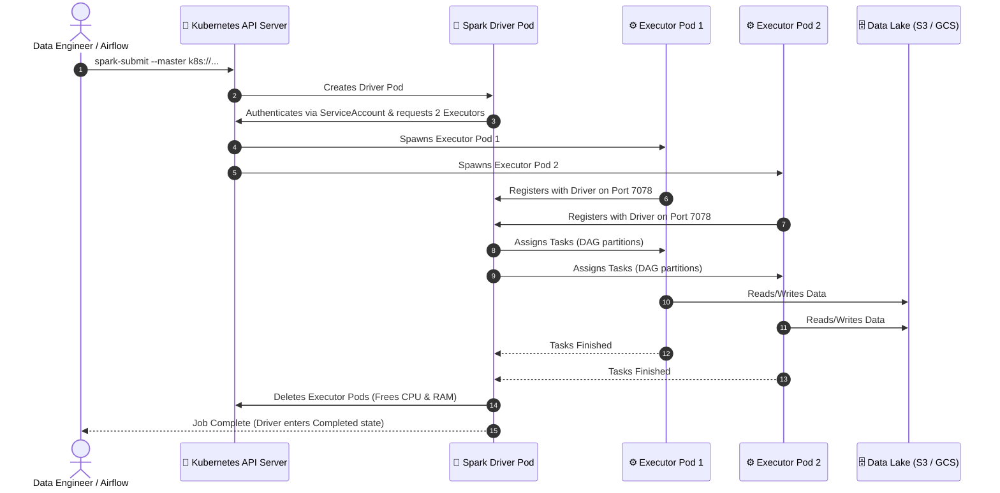
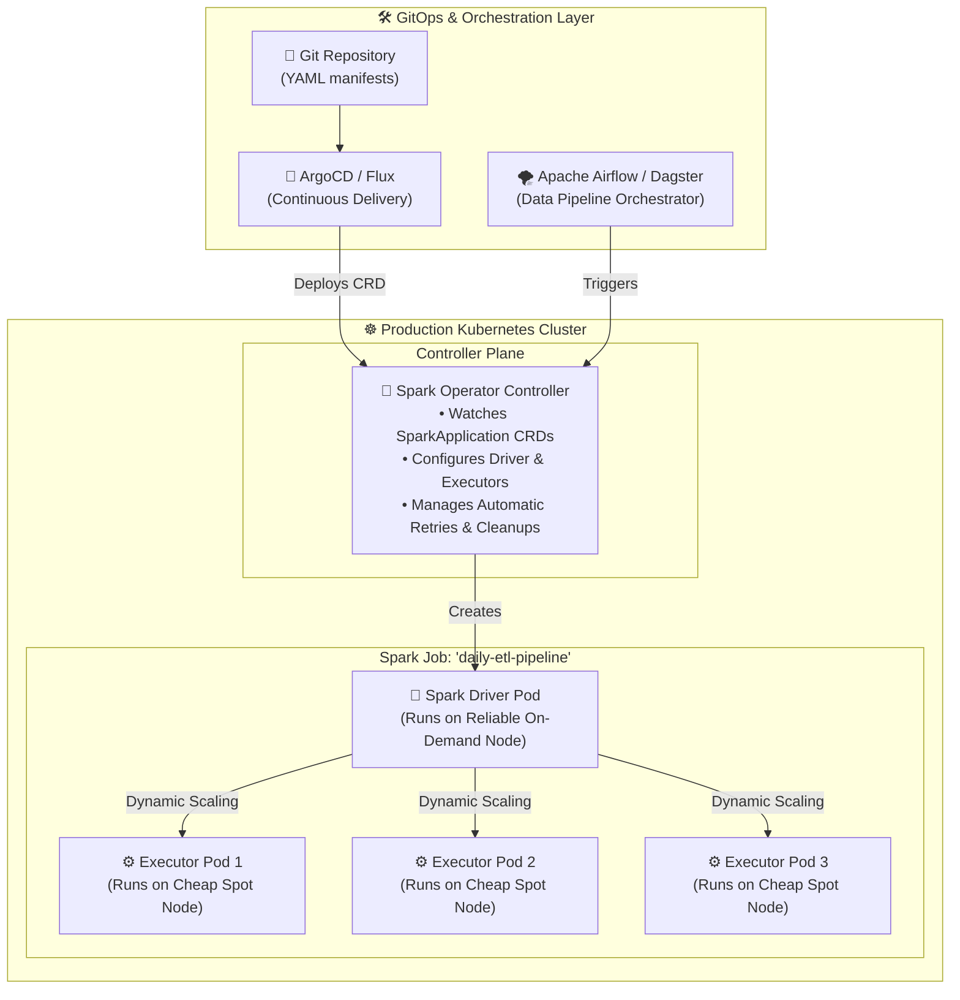
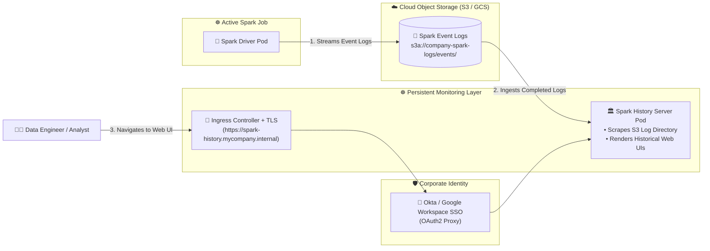
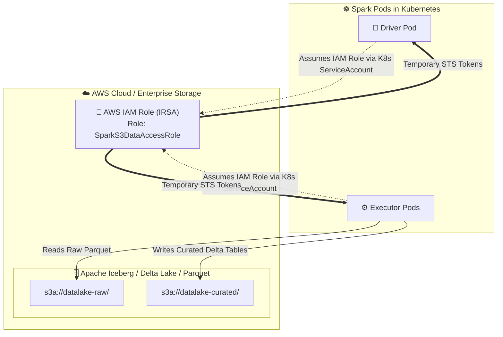
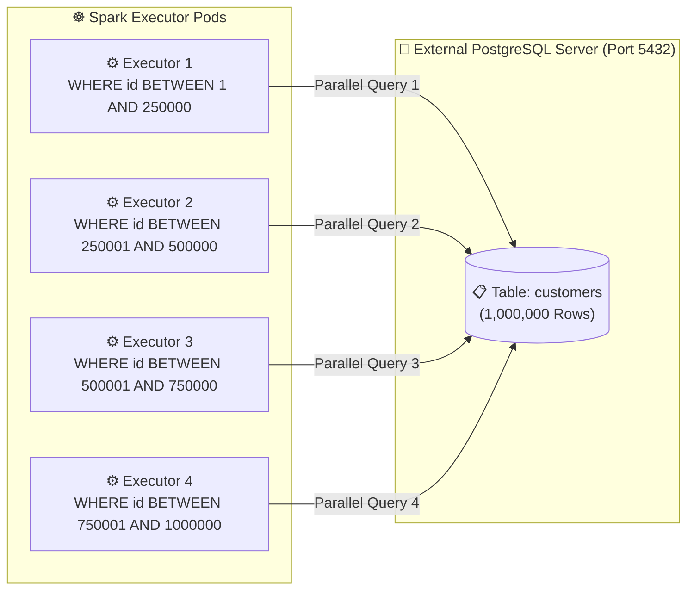

# 🌐 Production Apache Spark on Kubernetes: Architecture, Networking & Access Patterns

[](https://spark.apache.org/)
[](https://kubernetes.io/)
[](#)
[](https://github.com/kubeflow/spark-operator)

> **A deep architectural guide covering how Apache Spark runs in real-world enterprise Kubernetes production: Native K8s mode, Spark Operator, accessing the Web UI & History Server, connecting to Data Lakes (S3/GCS), and external databases (PostgreSQL).**

---

## 📑 Table of Contents

1. [Local Dev (Standalone) vs. Real Production (Cloud-Native K8s)](#1-local-dev-standalone-vs-real-production-cloud-native-k8s)
2. [Pattern 1: Native Spark on Kubernetes (`--master k8s://`)](#2-pattern-1-native-spark-on-kubernetes---master-k8s)
   - [How It Works Under the Hood](#how-it-works-under-the-hood)
   - [RBAC & ServiceAccount Requirements](#rbac--serviceaccount-requirements)
3. [Pattern 2: The Spark-on-K8s Operator Pattern (Declarative GitOps)](#3-pattern-2-the-spark-on-k8s-operator-pattern-declarative-gitops)
   - [Architectural Overview Diagram](#architectural-overview-diagram-spark-operator)
   - [Production SparkApplication CRD Manifest](#production-sparkapplication-crd-manifest)
4. [Pattern 3: Accessing the Spark Web UI & History Server in Production](#4-pattern-3-accessing-the-spark-web-ui--history-server-in-production)
   - [The Ephemeral UI Problem](#the-ephemeral-ui-problem)
   - [The Production Solution: Spark History Server + S3/GCS](#the-production-solution-spark-history-server--s3gcs)
5. [Pattern 4: Connecting Spark to External Data Lakes (AWS S3, MinIO, GCS)](#5-pattern-4-connecting-spark-to-external-data-lakes-aws-s3-minio-gcs)
   - [S3A Connector Architecture](#s3a-connector-architecture)
   - [Secure Authentication via IAM Roles for Service Accounts (IRSA)](#secure-authentication-via-iam-roles-for-service-accounts-irsa)
6. [Pattern 5: Connecting Spark to External PostgreSQL Databases (JDBC)](#6-pattern-5-connecting-spark-to-external-postgresql-databases-jdbc)
   - [High-Throughput Parallel Partition Reading](#high-throughput-parallel-partition-reading)
7. [Pattern 6: Shuffle Data & Dynamic Allocation (Apache Celeborn)](#7-pattern-6-shuffle-data--dynamic-allocation-apache-celeborn)
8. [Production Cost & Performance Best Practices](#8-production-cost--performance-best-practices)
9. [Summary Comparison Table](#9-summary-comparison-table)

---

## 1. Local Dev (Standalone) vs. Real Production (Cloud-Native K8s)

```
┌──────────────────────────────────────────────┐       ┌──────────────────────────────────────────────────┐
│      Local Dev / Standalone Spark Cluster    │  VS   │       Production Cloud-Native Spark on K8s       │
├──────────────────────────────────────────────┤       ├──────────────────────────────────────────────────┤
│ • Fixed Master Pod + Fixed Worker Pods       │       │ • Zero idle workers (scales down to 0)           │
│ • Runs 24/7 wasting CPU/Memory when idle     │       │ • Driver & Executors spawned on-demand per job   │
│ • Static resource allocation                 │       │ • Dynamic Allocation (Executors scale with data) │
│ • Jobs share single JVM / noisy neighbors    │       │ • Strict isolation: each job gets its own pods   │
│ • Manual restart if worker crashes           │       │ • Spot/Preemptible instances save 70% cost       │
└──────────────────────────────────────────────┘       └──────────────────────────────────────────────────┘
```

---

## 2. Pattern 1: Native Spark on Kubernetes (`--master k8s://`)

In Kubernetes native mode, Spark does **not** need a Spark Master node at all! The **Kubernetes API Server** itself acts as the Master cluster manager.

### How It Works Under the Hood



### RBAC & ServiceAccount Requirements

Because the Spark Driver needs permission to create and delete Executor pods inside Kubernetes, you must create a dedicated `ServiceAccount` and `Role`:

```yaml
apiVersion: v1
kind: ServiceAccount
metadata:
  name: spark-driver-sa
  namespace: spark
---
apiVersion: rbac.authorization.k8s.io/v1
kind: Role
metadata:
  name: spark-driver-role
  namespace: spark
rules:
  - apiGroups: [""]
    resources: ["pods"]
    verbs: ["*"]
  - apiGroups: [""]
    resources: ["services", "configmaps", "persistentvolumeclaims"]
    verbs: ["create", "get", "delete", "list", "watch"]
---
apiVersion: rbac.authorization.k8s.io/v1
kind: RoleBinding
metadata:
  name: spark-driver-rb
  namespace: spark
subjects:
  - kind: ServiceAccount
    name: spark-driver-sa
    namespace: spark
roleRef:
  kind: Role
  name: spark-driver-role
  apiGroup: rbac.authorization.k8s.io
```

---

## 3. Pattern 2: The Spark-on-K8s Operator Pattern (Declarative GitOps)

Used by enterprise tech giants (Apple, Netflix, Lyft), the **Google / Kubeflow Spark Operator** lets you define Spark applications declaratively as custom Kubernetes YAML objects (`kind: SparkApplication`).

### Architectural Overview Diagram: Spark Operator



### Production `SparkApplication` CRD Manifest:

```yaml
# production-spark-app.yaml
apiVersion: "sparkoperator.k8s.io/v1beta2"
kind: SparkApplication
metadata:
  name: daily-sales-aggregator
  namespace: spark
spec:
  type: Python
  pythonVersion: "3"
  mode: cluster
  image: "docker.io/mycompany/spark-py:v3.5.0"
  imagePullPolicy: IfNotPresent
  mainApplicationFile: "local:///opt/spark/work-dir/sales_job.py"
  sparkVersion: "3.5.0"
  restartPolicy:
    type: OnFailure
    onFailureRetries: 3
    onFailureRetryInterval: 10
    onSubmissionFailureRetries: 5
  driver:
    cores: 1
    coreLimit: "1200m"
    memory: "1024m"
    labels:
      version: 3.5.0
    serviceAccount: spark-driver-sa
    nodeSelector:
      k8s.io/capacity-type: "on-demand" # Drivers need high stability
  executor:
    cores: 2
    instances: 4
    memory: "2048m"
    memoryOverhead: "512m"
    labels:
      version: 3.5.0
    nodeSelector:
      k8s.io/capacity-type: "spot"      # Executors run on 70% cheaper Spot VMs
```

Apply with:
```bash
kubectl apply -f production-spark-app.yaml
```

---

## 4. Pattern 3: Accessing the Spark Web UI & History Server in Production

### The Ephemeral UI Problem:
When you run a Spark job, the Driver exposes port `4040` (Application Web UI). But as soon as the job finishes or crashes, **the Driver Pod terminates and the Web UI disappears forever!**

### The Production Solution: Spark History Server + S3/GCS



#### Spark Configuration for Event Logging:
```ini
spark.eventLog.enabled=true
spark.eventLog.dir=s3a://my-company-spark-logs/events
spark.history.fs.logDirectory=s3a://my-company-spark-logs/events
```

---

## 5. Pattern 4: Connecting Spark to External Data Lakes (AWS S3, MinIO, GCS)

In production Kubernetes, Spark pods never store data on their local disks. All data lives in object storage data lakes (**AWS S3, Google Cloud Storage, or on-prem MinIO**).

### S3A Connector Architecture



### PySpark S3A Code Example:

```python
from pyspark.sql import SparkSession

spark = SparkSession.builder     .appName("S3DataLakeETL")     .config("spark.hadoop.fs.s3a.impl", "org.apache.hadoop.fs.s3a.S3AFileSystem")     .config("spark.hadoop.fs.s3a.aws.credentials.provider", "com.amazonaws.auth.WebIdentityTokenCredentialsProvider")     .getOrCreate()

# Read raw telemetry data from S3
df = spark.read.parquet("s3a://datalake-raw/telemetry/2026/09/*")

# Perform analytics
aggregated_df = df.groupBy("device_type").count()

# Write results back to curated S3 bucket
aggregated_df.write.mode("overwrite").parquet("s3a://datalake-curated/device_summary/")
```

---

## 6. Pattern 5: Connecting Spark to External PostgreSQL Databases (JDBC)

When reading or writing large tables from an external PostgreSQL database (see [Production Database Access Patterns](../postgresql/production_access_patterns.md)), **single-threaded reads will be slow**.

Spark can parallelize PostgreSQL reads across multiple worker executors using **Partition Column Slicing**:



### Production PySpark JDBC Snippet:

```python
# Read 1 Million rows in parallel across 4 executors
df = spark.read.format("jdbc")     .option("url", "jdbc:postgresql://postgres-service.database.svc.cluster.local:5432/analytics_db")     .option("dbtable", "ecommerce.customers")     .option("user", "admin")     .option("password", "SuperSecretPassword123!")     .option("partitionColumn", "customer_id")     .option("lowerBound", 1)     .option("upperBound", 1000000)     .option("numPartitions", 4)     .load()
```

---

## 7. Pattern 6: Shuffle Data & Dynamic Allocation (Apache Celeborn)

In Kubernetes, worker pods are ephemeral and can be preempted. If an executor pod holding intermediate shuffle files is killed by a Kubernetes node autoscaler, **the entire stage fails and must be recomputed**.

### Production Solution: Remote Shuffle Service (RSS)
Modern enterprise Spark architectures deploy **Apache Celeborn (Incubating)** or **Apache Uniffle**:

- Intermediate shuffle data is written to a dedicated, persistent Celeborn cluster instead of local container disks.
- Spark Executor pods become completely **stateless**. If an executor is preempted by AWS Spot reclamation, no shuffle data is lost, achieving 100% fault tolerance!

---

## 8. Production Cost & Performance Best Practices

| Best Practice | How to Implement | Impact |
| :--- | :--- | :--- |
| **Spot / Preemptible Instances** | Set `nodeSelector: { capacity: spot }` on Executors. | **Saves 60–80%** on cloud compute costs. |
| **On-Demand Instances for Driver** | Set `nodeSelector: { capacity: on-demand }` on Driver. | Prevents entire job failure due to Spot termination. |
| **Memory Overhead Buffer** | Set `spark.executor.memoryOverhead=512m` (or 10–20% of heap). | Prevents Kubernetes `OOMKilled (Exit Code 137)`. |
| **Automated Log Rotation** | Configure S3 Lifecycle rules to delete Spark logs after 30 days. | Prevents ballooning cloud storage bills. |
| **Prometheus Metrics** | Enable `spark.ui.prometheus.enabled=true` (Port 4040/metrics/executors). | Real-time memory & CPU bottleneck monitoring. |

---

## 9. Summary Comparison Table

| Feature | Standalone Spark (KinD / Local) | Spark Native Mode (`--master k8s://`) | Spark Operator (Production GitOps) |
| :--- | :--- | :--- | :--- |
| **Master Node** | Dedicated Spark Master Pod | K8s API Server | K8s API Server + Operator Controller |
| **Worker Allocation** | Fixed (always running) | On-Demand (spawns per job) | On-Demand (spawns per job) |
| **Management** | Imperative `spark-submit` | CLI `spark-submit` | Declarative Kubernetes YAML CRD |
| **Best For** | Local testing, learning | Interactive notebooks (Jupyter) | Production ETL, Airflow, CI/CD |
