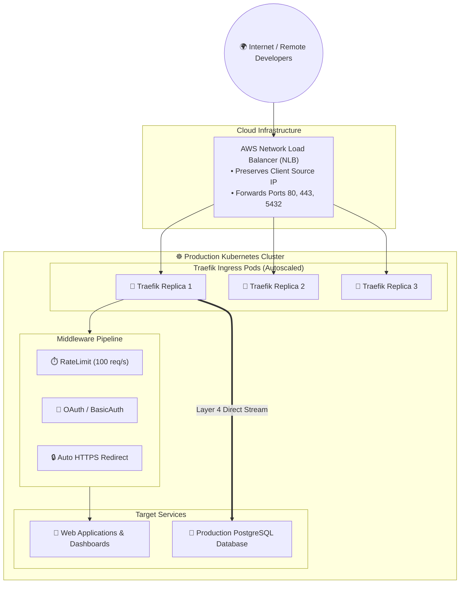
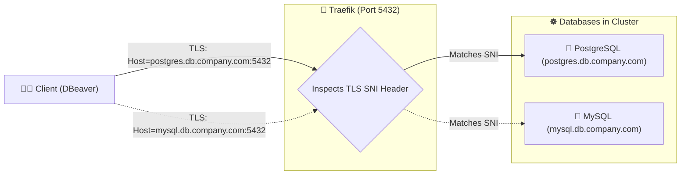

# 🌐 Traefik in Production: Architecture, Middlewares, SSL & TCP SNI Routing

[](https://traefik.io/)
[](#)
[](#)

> **A production architectural deep dive into Traefik v3 on Kubernetes: Reusable Middlewares (RateLimiting, BasicAuth, Headers), Automated Let's Encrypt SSL/TLS certificates (ACME), and Layer 4 TCP SNI database routing.**

---

## 📑 Table of Contents

1. [Traefik Production Architecture](#1-traefik-production-architecture)
2. [Pattern 1: Reusable Middlewares (Security & Traffic Control)](#2-pattern-1-reusable-middlewares-security--traffic-control)
3. [Pattern 2: Automated Let's Encrypt SSL/TLS with ACME](#3-pattern-2-automated-lets-encrypt-ssltls-with-acme)
4. [Pattern 3: Layer 4 TCP SNI Routing (Multiple Databases on One Port!)](#4-pattern-3-layer-4-tcp-sni-routing-multiple-databases-on-one-port)
5. [Pattern 4: High-Availability (HA) & Distributed Metrics](#5-pattern-4-high-availability-ha--distributed-metrics)
6. [Summary Comparison: NGINX vs Traefik](#6-summary-comparison-nginx-vs-traefik)

---

## 1. Traefik Production Architecture

In production cloud environments (AWS EKS, GCP GKE), Traefik sits behind a cloud **Network Load Balancer (NLB)**:



---

## 2. Pattern 1: Reusable Middlewares (Security & Traffic Control)

Unlike NGINX where you have to copy-paste messy annotations on every ingress file, Traefik uses **declarative Middleware CRDs**:

### Example 1: Rate Limiting & Security Headers
```yaml
apiVersion: traefik.io/v1alpha1
kind: Middleware
metadata:
  name: security-headers-and-ratelimit
  namespace: traefik
spec:
  rateLimit:
    average: 100
    burst: 50
  headers:
    sslRedirect: true
    stsSeconds: 315360000
    browserXssFilter: true
    contentTypeNosniff: true
```

Attach to any `IngressRoute` in one line:
```yaml
spec:
  routes:
    - match: Host(`api.mycompany.com`)
      middlewares:
        - name: security-headers-and-ratelimit
```

---

## 3. Pattern 2: Automated Let's Encrypt SSL/TLS with ACME

Traefik has a built-in ACME client that provisions and auto-renews free **Let's Encrypt SSL certificates** without needing Cert-Manager!

```yaml
# In traefik-values.yaml:
certificatesResolvers:
  letsencrypt:
    acme:
      email: "devops@mycompany.com"
      storage: "/data/acme.json"
      httpChallenge:
        entryPoint: web
```

In your `IngressRoute`:
```yaml
spec:
  entryPoints:
    - websecure
  tls:
    certResolver: letsencrypt
```

---

## 4. Pattern 3: Layer 4 TCP SNI Routing (Multiple Databases on One Port!)

One of Traefik's most impressive superpowers is **SNI Routing (Server Name Indication)** on Layer 4:

If clients connect using TLS/SSL, Traefik can host **PostgreSQL, MySQL, and MongoDB on the EXACT SAME PORT 5432!**



---

## 5. Pattern 4: High-Availability (HA) & Distributed Metrics

- **Autoscaling:** Traefik scales horizontally using a `HorizontalPodAutoscaler` based on CPU or HTTP request count.
- **Prometheus Metrics:** Traefik exposes native Prometheus metrics on `/metrics` for Grafana dashboards (total requests, 4xx/5xx error rates, response time latency per service).

---

## 6. Summary Comparison: NGINX vs Traefik

| Feature | NGINX Ingress | Traefik v3 |
| :--- | :--- | :--- |
| **Layer 4 TCP Support** | Requires NodePort / manual ConfigMap | **Native `IngressRouteTCP`** 🏆 |
| **Visual Dashboard** | ❌ None | **✅ Built-in Web UI (Port 9000)** |
| **Middlewares** | Messy annotations in every file | **Reusable K8s Custom Resources** |
| **Auto SSL (Let's Encrypt)** | Requires Cert-Manager | **Built-in native ACME client** |
| **Configuration Reloads** | Reloads NGINX process (can drop connections) | **Hot dynamic reload in memory (Zero drop)** |
