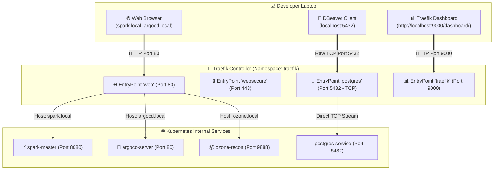

# 🚦 Modern L4 + L7 Ingress: Deploying Traefik v3 on Kubernetes & KinD

[](https://traefik.io/)
[](#)
[](https://kubernetes.io/)
[](https://helm.sh/)
[](https://kind.sigs.k8s.io/)

> **Step into the future of Kubernetes networking! Learn how to deploy Traefik v3 as a unified Layer 4 (TCP) and Layer 7 (HTTP) Ingress Controller. Route web dashboards (`spark.local`, `argocd.local`) AND route PostgreSQL (`localhost:5432` to DBeaver) with ZERO port-forwarding and NO clunky NodePorts!**

---

## 📑 Table of Contents

1. [Why Traefik Beats NGINX (The L4 + L7 Superpower)](#1-why-traefik-beats-nginx-the-l4--l7-superpower)
2. [Traefik Architecture on KinD (EntryPoints Breakdown)](#2-traefik-architecture-on-kind-entrypoints-breakdown)
3. [Prerequisites](#3-prerequisites)
4. [Step 1: Install Traefik v3 with Helm](#step-1-install-traefik-v3-with-helm)
5. [Step 2: Verify Traefik Deployment & Dashboard](#step-2-verify-traefik-deployment--dashboard)
6. [Step 3: Setup Local Domain Names (/etc/hosts)](#step-3-setup-local-domain-names-etchosts)
7. [Step 4: Deploy IngressRoutes (HTTP Web + TCP Postgres)](#step-4-deploy-ingressroutes-http-web--tcp-postgres)
8. [Step 5: Test Web Dashboards in Browser (L7 HTTP)](#step-5-test-web-dashboards-in-browser-l7-http)
9. [Step 6: Test DBeaver PostgreSQL Connection (L4 TCP)](#step-6-test-dbeaver-postgresql-connection-l4-tcp)
10. [Useful Traefik Commands & Administration](#useful-traefik-commands--administration)
11. [Troubleshooting & Pro Tips](#troubleshooting--pro-tips)
12. [Cleanup](#12-cleanup)

---

## 1. Why Traefik Beats NGINX (The L4 + L7 Superpower)

Traditional Ingress Controllers like NGINX were designed almost exclusively for **Layer 7 (HTTP/HTTPS)** websites. Exposing a database required ugly, complex hacks like high `NodePort` numbers (30000–32767).

**Traefik v3 is a modern, unified Layer 4 (TCP/UDP) AND Layer 7 (HTTP) reverse proxy:**

```
┌─────────────────────────────────┬─────────────────────────────────┬─────────────────────────────────┐
│ Feature                         │ NGINX Ingress Controller        │ Traefik v3 Ingress Controller   │
├─────────────────────────────────┼─────────────────────────────────┼─────────────────────────────────┤
│ Layer 7 (HTTP / HTTPS)          │ Yes                             │ Yes                             │
│ Layer 4 (TCP / UDP Databases)   │ Requires clunky NodePort        │ Native L4 (IngressRouteTCP) 🏆  │
│ Built-in Live Web Dashboard     │ None (Requires external Grafana)│ Built-in Real-time Dashboard 🎨 │
│ Middlewares (RateLimit, Auth)   │ Messy annotations in YAML       │ Clean, reusable K8s CRDs        │
│ Modern CRDs                     │ Standard Ingress only           │ IngressRoute, IngressRouteTCP   │
└─────────────────────────────────┴─────────────────────────────────┴─────────────────────────────────┘
```

---

## 2. Traefik Architecture on KinD (EntryPoints Breakdown)

In Traefik, network ports are called **EntryPoints**. Because our [`kind-config.yaml`](../kind-config.yaml) maps ports 80, 443, 5432, and 9000 to your host laptop:



---

## 3. Prerequisites

Before starting, ensure you have:
- [x] A running **KinD cluster** configured with ports 80, 443, 5432, 9000 (see [kind-config.yaml](../kind-config.yaml)).
- [x] `kubectl` and `helm` installed.

---

## Step 1: Install Traefik v3 with Helm

### 1. Add Traefik Helm Repository:
```bash
helm repo add traefik https://traefik.github.io/charts
helm repo update
```

### 2. Deploy Traefik into the `traefik` namespace:
Use our pre-configured [`traefik-values.yaml`](traefik-values.yaml) which enables:
- Pinned image `traefik:v3.2.0`
- Entrypoints: `web` (80), `websecure` (443), `postgres` (5432 TCP), `traefik` (9000)
- Real-time Web Dashboard enabled

```bash
# Deploy Traefik
helm install traefik traefik/traefik   --namespace traefik   --create-namespace   -f "k8 setup/traefik/traefik-values.yaml"
```

---

## Step 2: Verify Traefik Deployment & Dashboard

### 1. Check Pod Status:
```bash
kubectl get pods -n traefik -w
```
Wait until `traefik-xxxx` shows `1/1 Running`.

### 2. Open the Traefik Real-Time Dashboard:
Open your browser and navigate to:  
👉 **`http://localhost:9000/dashboard/`** *(Note the trailing slash `/`)*

You will see the **Traefik Live Dashboard** displaying:
- Active HTTP Routers & Services
- Active TCP Routers (PostgreSQL)
- Real-time request metrics, latency, and TLS certificates!

---

## Step 3: Setup Local Domain Names (/etc/hosts)

Add these friendly local domain names to your host's `/etc/hosts` file:

### 🐧 Linux & 🍎 macOS:
```bash
echo "127.0.0.1 spark.local argocd.local ozone.local traefik.local" | sudo tee -a /etc/hosts
```

### 🪟 Windows:
Open `C:\Windows\System32\drivers\etc\hosts` in Notepad (as Administrator) and append:
```text
127.0.0.1 spark.local argocd.local ozone.local traefik.local
```

---

## Step 4: Deploy IngressRoutes (HTTP Web + TCP Postgres)

Traefik provides custom Kubernetes Custom Resources (**CRDs**) that are much cleaner and more powerful than standard Ingress:
- **`IngressRoute`** (for Layer 7 HTTP)
- **`IngressRouteTCP`** (for Layer 4 TCP Databases)

Apply our complete manifest [`traefik-routes.yaml`](traefik-routes.yaml):

```yaml
# traefik-routes.yaml
# ------------------------------------------------------------------------------
# ⚡ 1. Layer 7 Route: Apache Spark Web Dashboard
# ------------------------------------------------------------------------------
apiVersion: traefik.io/v1alpha1
kind: IngressRoute
metadata:
  name: spark-ingress
  namespace: spark
spec:
  entryPoints:
    - web
  routes:
    - match: Host(`spark.local`)
      kind: Rule
      services:
        - name: spark-master
          port: 8080
---
# ------------------------------------------------------------------------------
# 🐙 2. Layer 7 Route: ArgoCD Web Dashboard
# ------------------------------------------------------------------------------
apiVersion: traefik.io/v1alpha1
kind: IngressRoute
metadata:
  name: argocd-ingress
  namespace: argocd
spec:
  entryPoints:
    - web
  routes:
    - match: Host(`argocd.local`)
      kind: Rule
      services:
        - name: argocd-server
          port: 80
---
# ------------------------------------------------------------------------------
# 🐘 3. Layer 4 Route: PostgreSQL TCP (Zero Port-Forwarding!)
# ------------------------------------------------------------------------------
apiVersion: traefik.io/v1alpha1
kind: IngressRouteTCP
metadata:
  name: postgres-tcp-route
  namespace: database
spec:
  entryPoints:
    - postgres # Listens on hostPort 5432
  routes:
    - match: HostSNI(`*`) # Catch all TCP database traffic
      services:
        - name: postgres-service
          port: 5432
```

Apply the routes:
```bash
kubectl apply -f "k8 setup/traefik/traefik-routes.yaml"
```

---

## Step 5: Test Web Dashboards in Browser (L7 HTTP)

Open your browser and test the URLs:
- ⚡ **`http://spark.local`** ➔ Opens **Apache Spark Master UI**!
- 🐙 **`http://argocd.local`** ➔ Opens **ArgoCD GitOps Dashboard**!
- 📊 **`http://localhost:9000/dashboard/`** ➔ Opens **Traefik Visual Dashboard**!

---

## Step 6: Test DBeaver PostgreSQL Connection (L4 TCP)

Now for the ultimate test: **Connecting to PostgreSQL without `kubectl port-forward`!**

1. Open **DBeaver**.
2. Click **New Connection** ➔ **PostgreSQL**.
3. Settings:
   - **Host:** `localhost`
   - **Port:** `5432`
   - **Database:** `analytics_db`
   - **Username:** `admin`
   - **Password:** `SuperSecretPassword123!`
4. Click **"Test Connection"**!

🎉 **Success:** You are connected directly through Traefik's Layer 4 TCP proxy!

---

## Useful Traefik Commands & Administration

| Task | Command |
| :--- | :--- |
| **View Traefik live logs** | `kubectl logs -f -n traefik -l app.kubernetes.io/name=traefik` |
| **List all HTTP IngressRoutes** | `kubectl get ingressroutes -A` |
| **List all TCP IngressRoutes** | `kubectl get ingressroutetcps -A` |
| **Describe an IngressRoute** | `kubectl describe ingressroute spark-ingress -n spark` |

---

## Troubleshooting & Pro Tips

> [!WARNING]
> **Error: "Port 5432 is already in use" on KinD startup:**  
> If you already have PostgreSQL installed directly on your laptop host OS, stop the local service:
> ```bash
> sudo systemctl stop postgresql # Linux
> brew services stop postgresql  # macOS
> ```

> [!TIP]
> **Middleware Superpowers:**  
> Traefik allows attaching reusable **Middlewares** to any route with 2 lines of YAML:
> - Auto HTTPS Redirect
> - Rate Limiting (e.g. max 100 req/sec)
> - Basic Authentication popup
> - Path Prefix stripping (`/api/v1`)

---

## Cleanup

To uninstall Traefik:
```bash
kubectl delete -f "k8 setup/traefik/traefik-routes.yaml"
helm uninstall traefik -n traefik
kubectl delete namespace traefik
```
